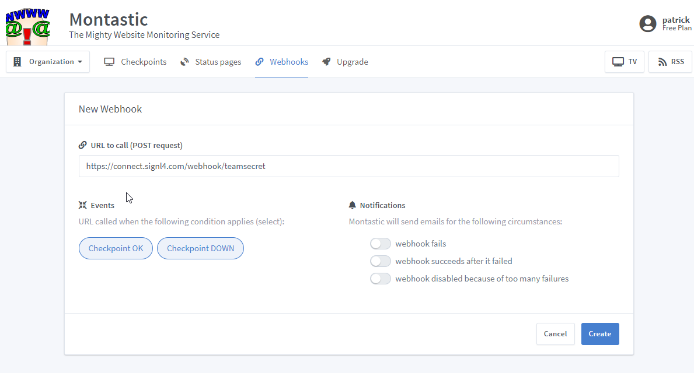
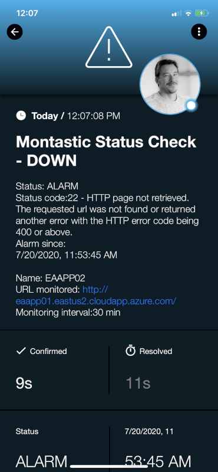

# SIGNL4 Integration with Montastic

[Montastic](https://montastic.com/) is a cloud-based monitoring system.  This tool is perfect monitoring the status of your servers and applications to make sure they are reachable.  The monitoring dashboard gives a great overview of your setup but where SIGNL4 comes in is at the alerting level.  Montastic has many integration methods for connecting to external applications.  We will direct tickets to the right people at the right time using the SIGNL4 webhook.  With on-call duty scheduling and a tiered escalation to a manager, SIGNL4 ensures that the email will not be lost in a sea of emails.

In our example we are going to forward Montastic status information via webhook to the SIGNL4 team.  This will alert all team members on duty via Push, SMS and Voice notifications.

SIGNL4 is a mobile alert notification app for powerful alerting, alert management and mobile assignment of work items.  Get the app at [https://www.signl4.com](https://www.signl4.com/)

## Prerequisites

- A SIGNL4 ([https://www.signl4.com](https://www.signl4.com/)) account
- A Montastic ([https://montastic.com/](https://montastic.com/)) account

## How to Integrate

In order to not disturb any of the current workflows you may already have setup, we are simply going to add a new webhook that will forward Montastic status information to the SIGNL4 team.  
To do this follow these steps:

1. Login to the admin console  
2. Click on Webhooks  
3. Click Create New  
4. Populate the URL with the team specific webhook  
5. Click Create

Now the next time a checkpoint is unreachable an alert will display in the SIGNL4 mobile app.

