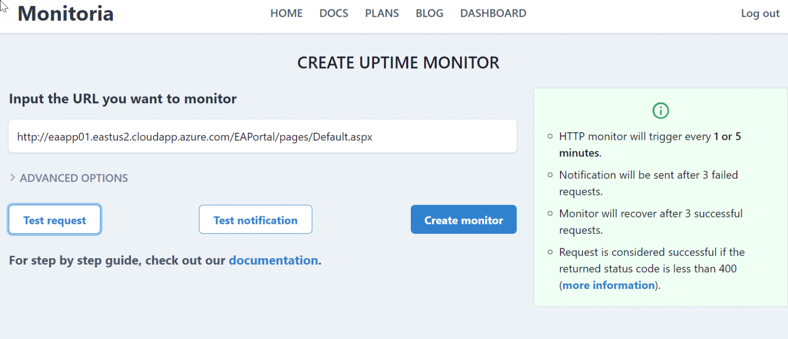
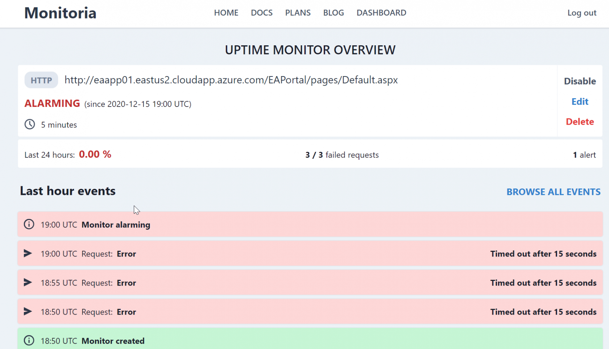
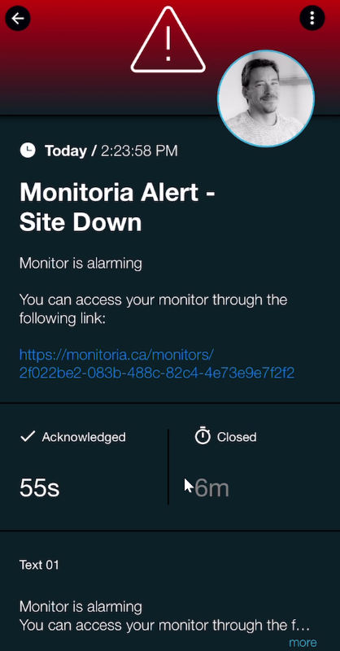
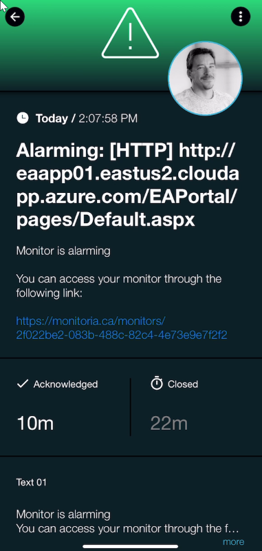

# SIGNL4 Integration with Monitoria

When critical systems fail, SIGNL4 is the fastest way to alert your staff, engineers, IT admins on call and “in the field”. SIGNL4 provides reliable notifications via mobile app push, text and voice calls with tracking, escalations and duty scheduling.

[Monitoria](https://monitoria.ca/) is a cloud based site monitoring solution that is very lightweight and easy to get started.  Performance monitors are easy to configure, and notifications are automatically sent to the email address who signed up for the account.  SIGNL4 can intercept this email and distribute the alert to several engineers at once.  SIGNL4 ensures that all on duty members receive, acknowledge and resolve critical alerts, all from their smartphones. With persistent notifications and escalation chains there will never be a critical alert that goes unattended. SIGNL4 also offers ad-hoc collaboration between team members for each alert, so Subject Matter Experts can be looped in to help resolve issues.

In our example we are using Monitoria to monitor the heartbeat of critical servers.  We are setting up a site monitor and will send alerts to the SIGNL4 team when the server is unreachable.

SIGNL4 is a mobile alert notification app for powerful alerting, alert management and mobile assignment of work items.  Get the app at [https://www.signl4.com](https://www.signl4.com/)

## Prerequisites

- A SIGNL4 ([https://www.signl4.com](https://www.signl4.com/)) account
- A Monitoria ([https://monitoria.ca/](https://monitoria.ca/)) account

## How to Integrate

First, setup a monitor. From the Monitoria dashboard click New Uptime Monitor

Enter a URL you want to monitor. We will use the web portal of an application server.

Click on Create Monitor. By default, there is a 5 min interval check.  Upon 3 failures of this check, a notification is emailed out.  The email is pretty basic with a link to the online monitoring page.

We have sent this email to the SIGNL4 dedicated address for mobile alerting. Using the Services & Systems we have changed the color and the Title of the alert.

