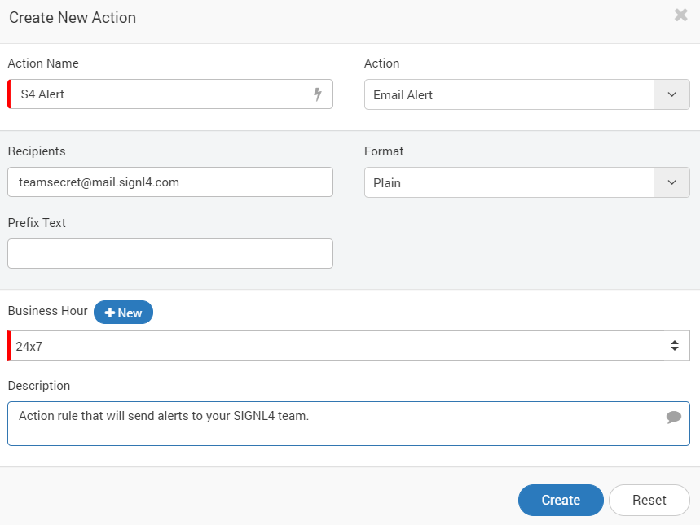
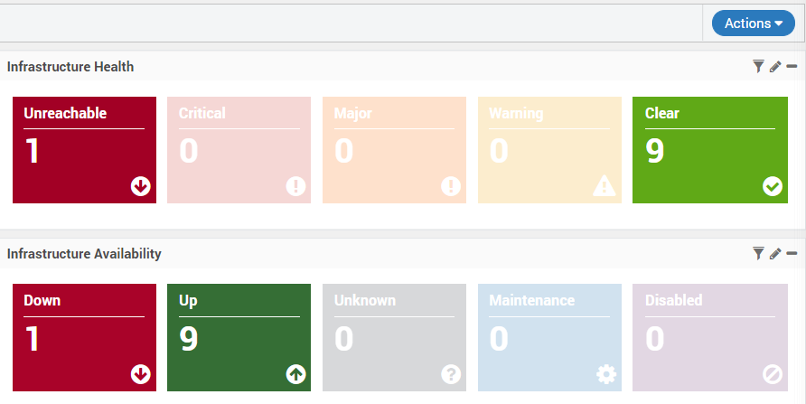
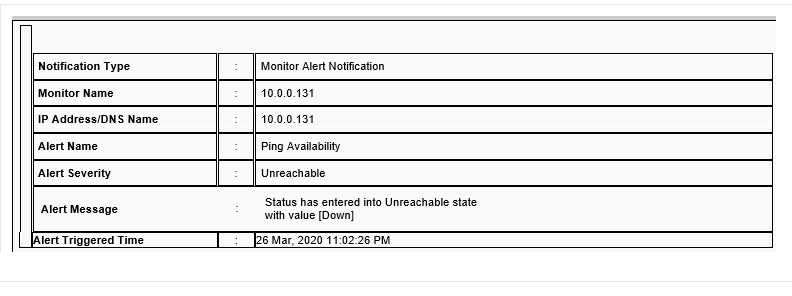
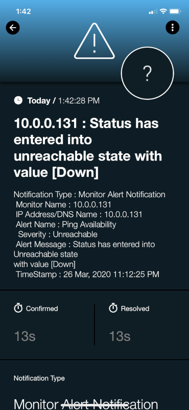
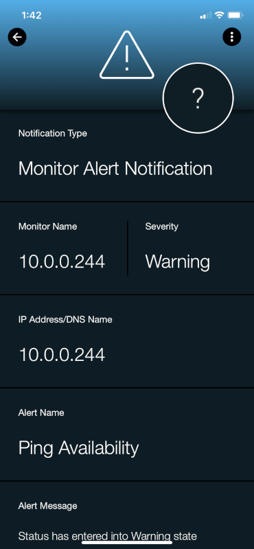

# SIGNL4 Integration with Motadata

[Motadata](https://www.motadata.com/) is a network, database, server and application monitor that uses a wide variety of built in policies to alert on incidents that happen.  Performance monitors are easy to configure, and notifications channels are configured with just a few clicks.  SIGNL4 ensures that all on duty members receive, acknowledge and resolve critical alerts, all from their smartphones. With persistent notifications and escalation chains there will never be a critical alert that goes unattended. SIGNL4 also offers ad-hoc collaboration between team members for each alert, so Subject Matter Experts can be looped in to help resolve issues.

In our example we are using Motadata to ping critical servers in our infrastructure.  Policy actions will be put in place to send an email alert to the SIGNL4 team.

SIGNL4 is a mobile alert notification app for powerful alerting, alert management and mobile assignment of work items.  Get the app at [https://www.signl4.com](https://www.signl4.com/).

## Prerequisites

- A SIGNL4 ([https://www.signl4.com](https://www.signl4.com/)) account
- A Motadata ([https://www.motadata.com/](https://www.motadata.com/)) account

## How to Integrate

For our example we will assume that your network topology has all been discovered and there are current monitors in place.  We will assign a new action to the alert monitor which will forward an email to the SIGNL4 team.

Edit an existing monitor. We will use PING.  Select Alerts > Monitor Alerts and search for Ping.  The Ping Availability monitor will display. Click edit.

Once the monitor loads in the Unreachable section click New under actions.

Populate the action as shown below.

Click Update at the bottom of the screen.

That’s It! The next time this monitor triggers an email will be sent to the SIGNL4 team.

Click Update at the bottom of the screen.

That’s It! The next time this monitor triggers an email will be sent to the SIGNL4 team.

Emails are typically received like this.

SIGNL4 separates this data into nice boxes in an easy to read format.

