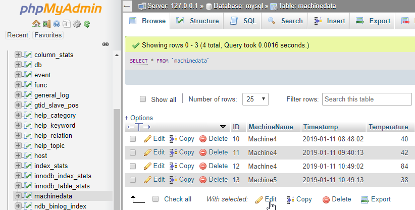

# SIGNL4 Integration with MySQL

In industry and production scenarios a lot of machine data is available. This can include the temperature of certain machines, time spans of certain processes, system pressure, power consumption, vibration detection, etc. The data is (or can be made) available in database tables and sometimes it is already being displayed on dashboards on computer screens. In daily operations, it is hard to look at each relevant dashboard all the time. Therefore, it makes sense to send relevant information about critical situations to the responsible users in real time no matter where they are. That is where SIGNL4 comes in.

Integrating SIGNL4 with any database can enhance your daily operations with an extension to your mobile team in the field or on the shop floor.

Gathering information from a database and sending team alerts in case of critical incidents is achieved with a simple script. In our case we use a PHP script that connect to the database, executes an SQL Select statement and sends an alert via SIGNL4 if necessary.

SIGNL4 is a mobile alert notification app for powerful alerting, alert management and for mobile assignment of work items. Get the app at [https://www.signl4.com](https://www.signl4.com/).

MySQL or MariaDB are widely used databases. Of course any other database will work in a similar way.

## Prerequisites

- A SIGNL4 ([https://www.signl4.com](https://www.signl4.com/)) account
- A MySQL or MariaDB database

## How to Integrate

To make your life easier we provide a fully working sample on GitHub at [https://github.com/signl4/signl4-integration-mysql-mariadb](https://github.com/signl4/signl4-integration-mysql-mariadb). This includes the PHP script as well as the SQL statements for creating the database table and inserting some sample data.


## Create the Database Table

In MySQL or MariaDB you can create a database table as follows.



## Create the PHP Script

Now you can create script in PHP (or whatever language you prefer) to do the following

## Connect to the database
Execute an SQL Select query to retrieve relevant records

In our case we just check for temperatures higher than 80 degrees within the last ten minutes.

```sql
SELECT [MachineName], MAX(Temperature) FROM MachineData WHERE Timestamp > DATEADD(MINUTE, -10, SYSDATETIME()) AND Temperature > 80 GROUP BY [MachineName];
```

You can adapt the query to fit your needs. You can also to some more sophisticated operations here like the average, maximum, number of occurrences or process data from multiple tables as well.

## Send the Alert using SIGNL4

If the above SQL query retrieved some records it means we have a situation worth communicating. In our script we use the SIGNL4 webhook to send the data to SIGNL4.

## Run the Script in Regular Intervals

Of course, we would like to check the database in regular intervals. Therefore in Linux / UNIX we can use a so-called cronjob.

In order to create a cronjobs in Linux UNIX you can use the following command:

```bash
crontab -e
```

A text editor will open and here you can add your script to be executed as well as the interval. This might look like this for a ten-minute interval:

```bash
\*/10 \* \* \* \* /home/user/bin/db2signl.php
```

You can find more information about the crontab format at [https://www.linuxwiki.de/crontab](https://www.linuxwiki.de/crontab).

## Test It

Now you can test your script manually first. Add some sample date into the database table that should trigger an alert. If all runs find you will receive the alert in your SIGNL4 app.

The alert in SIGNL4 might look like this.


