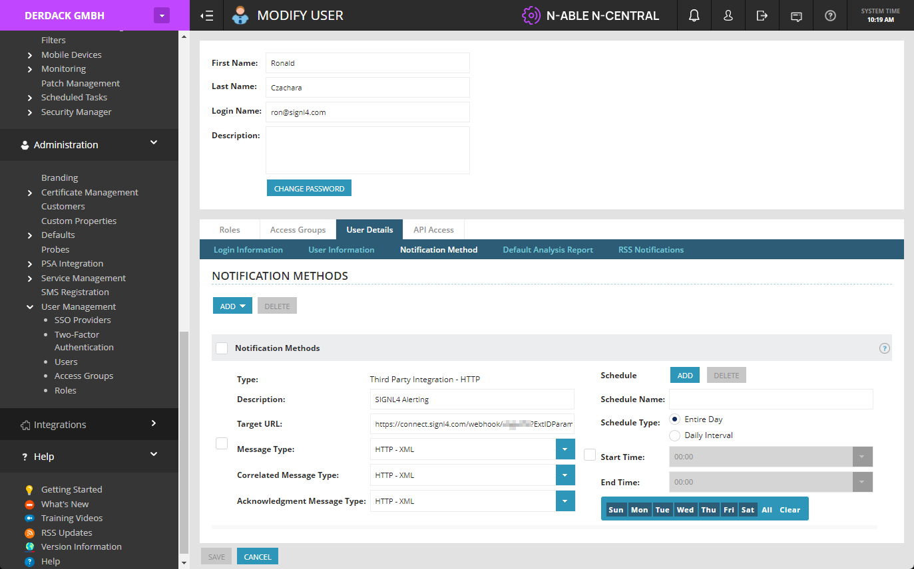

# SIGNL4 Integration with N-able

## How to Integrate

With [N-able](https://www.n-able.com/) you can centralize and streamline notifications and ticketing for specific systems or services without the need for separate point solutions. It offers powerful 24×7 monitoring and management for scale. It your system has an API you can monitor it with N-able.

SIGNL4 extends N-able and adds mobile alerting and incident response to N-able including push, SMS text, voice calls, escalations and collaboration. The integrated duty planning helps you to schedule your team’s on-call duties and allows you to see how is on duty at any given time.

In N-able N-central you configure all the devices to be monitored. Here you can also configure your SIGNL4 alerting.



In order to configure SIGNL4 alerting in N-central you go to Administration -> User Management -> Users. Select the respective user and in the user settings go to User Details -> Notification Method. Here add a new notification method “Third Party Integration – HTTP”. Give it a name and as URL enter the following:

```
https://connect.signl4.com/webhook/{team-secret}?ExtIDParam=DeviceName&ExtStatusParam=QualitativeNewState&ResolvedStatus=Normal
```

Here, {team-secret} is your SIGNL4 team or integration secret.

That’s it. Now you just need to make sure that your user gets alerted by assigning the user as a recipient to the respective notifications under Configuration -> Monitoring -> Notifications. Attention, you can also test the notifications here but this won’t work (i.e. it will not trigger an alert in SIGNL4) because the data format for the test notifications is not valid.

Alternatively you can also use the email notification method and use your SIGNL4 team’s email address as the email address of the notification method.

You can also find SIGNL4 in the N-able [integration section](https://www.n-able.com/integrations/derdack-signl4).

The alert in SIGNL4 might look like this.


