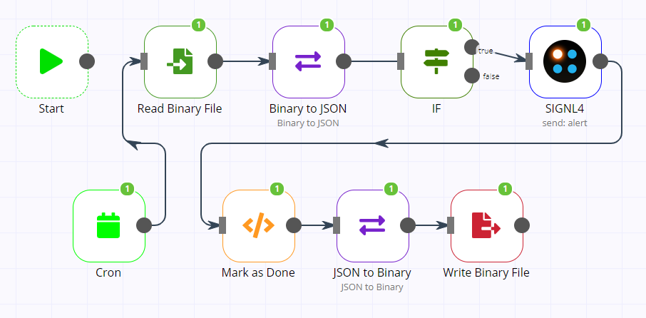
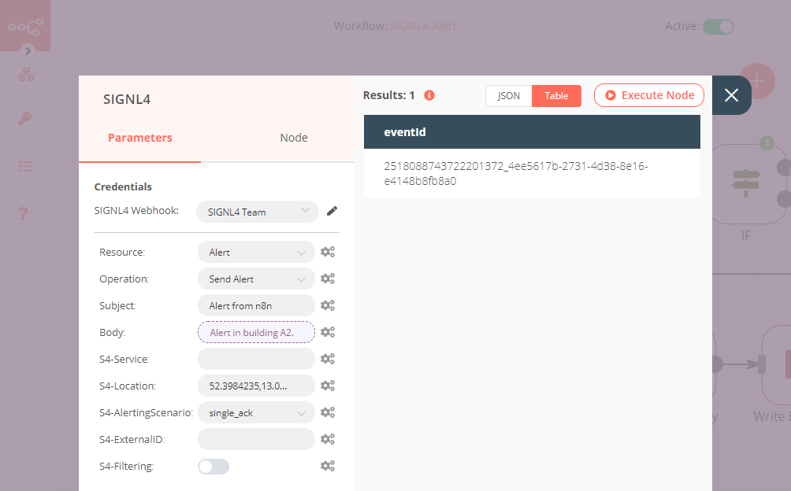
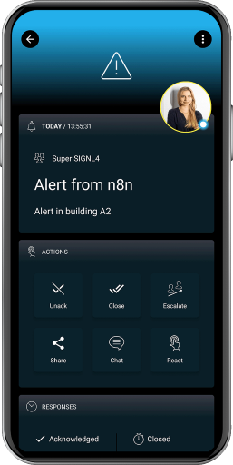

# SIGNL4 Integration with n8n

SIGNL4 is a mobile alert notification app for powerful alerting, alert management and mobile assignment of work items. Get the app at [https://www.signl4.com](https://www.signl4.com/).

In the workflow below we send information from a file to SIGNL4. For example, this can be data from a monitoring tool.



## Prerequisites
- A SIGNL4 ([https://www.signl4.com](https://www.signl4.com/)) account  
- n8n ([https://n8n.io](https://n8n.io/))

## n8n Workflow

In n8n, you can connect anything to everything. In our example we read data from a file and if a certain condition is met we send this information to our SIGNL4 team.

If you would like to use our sample workflow you can just copy the code below, click anywhere in the n8n window, and paste the code there.


```json
{
"name": "SIGNL4 Alert",
"nodes": [
{
"parameters": {},
"name": "Start",
"type": "n8n-nodes-base.start",
"typeVersion": 1,
"position": [
300,
60
]
},
{
"parameters": {
"subject": "Alert from n8n",
"body": "={{$node["Binary to JSON"].json["Body"]}}",
"xS4Location": "52.3984235,13.0544149"
},
"name": "SIGNL4",
"type": "n8n-nodes-base.SIGNL4",
"typeVersion": 1,
"position": [
1020,
60
],
"credentials": {
"SIGNL4Api": "SIGNL4 Team"
}
},
{
"parameters": {
"triggerTimes": {
"item": [
{
"mode": "everyHour"
}
]
}
},
"name": "Cron",
"type": "n8n-nodes-base.cron",
"typeVersion": 1,
"position": [
380,
290
]
},
{
"parameters": {
"fileName": "alert-data.json"
},
"name": "Write Binary File",
"type": "n8n-nodes-base.writeBinaryFile",
"position": [
910,
290
],
"typeVersion": 1
},
{
"parameters": {
"filePath": "alert-data.json"
},
"name": "Read Binary File",
"type": "n8n-nodes-base.readBinaryFile",
"position": [
480,
60
],
"typeVersion": 1
},
{
"parameters": {
"options": {}
},
"name": "Binary to JSON",
"type": "n8n-nodes-base.moveBinaryData",
"typeVersion": 1,
"position": [
660,
60
]
},
{
"parameters": {
"mode": "jsonToBinary",
"options": {}
},
"name": "JSON to Binary",
"type": "n8n-nodes-base.moveBinaryData",
"typeVersion": 1,
"position": [
750,
290
]
},
{
"parameters": {
"functionCode": "items[0].json  = $node["Binary to JSON"].json;nnitems[0].json.Done = true;nitems[0].json.eventId = $node["SIGNL4"].json.eventId;nnreturn items;"
},
"name": "Mark as Done",
"type": "n8n-nodes-base.function",
"position": [
590,
290
],
"typeVersion": 1
},
{
"parameters": {
"conditions": {
"boolean": [
{
"value1": "={{$node["Binary to JSON"].json["Done"]}}"
}
]
},
"combineOperation": "=all"
},
"name": "IF",
"type": "n8n-nodes-base.if",
"typeVersion": 1,
"position": [
840,
60
]
}
],
"connections": {
"Cron": {
"main": [
[
{
"node": "Read Binary File",
"type": "main",
"index": 0
}
]
]
},
"SIGNL4": {
"main": [
[
{
"node": "Mark as Done",
"type": "main",
"index": 0
}
]
]
},
"Read Binary File": {
"main": [
[
{
"node": "Binary to JSON",
"type": "main",
"index": 0
}
]
]
},
"Binary to JSON": {
"main": [
[
{
"node": "IF",
"type": "main",
"index": 0
}
]
]
},
"JSON to Binary": {
"main": [
[
{
"node": "Write Binary File",
"type": "main",
"index": 0
}
]
]
},
"Mark as Done": {
"main": [
[
{
"node": "JSON to Binary",
"type": "main",
"index": 0
}
]
]
},
"IF": {
"main": [
[
{
"node": "SIGNL4",
"type": "main",
"index": 0
}
]
]
}
},
"active": true,
"settings": {
"timezone": "Europe/Berlin"
},
"id": "1"
}
```


The file that we are reading here is a simple JSON file.

```json
{"Body":"Alert in building A2.","Done":false}
```

## SIGNL4 Integration

For the SIGNL4 node you just need to configure your team secret. This is the last part of your webhook URL. For the other settings you can use whatever is suitable for your scenario.



## Test It

Start the workflow and when the SIGNL4 node is executed, an alarm will be sent to your SIGNL4 team.

The alert in SIGNL4 might look like this.


