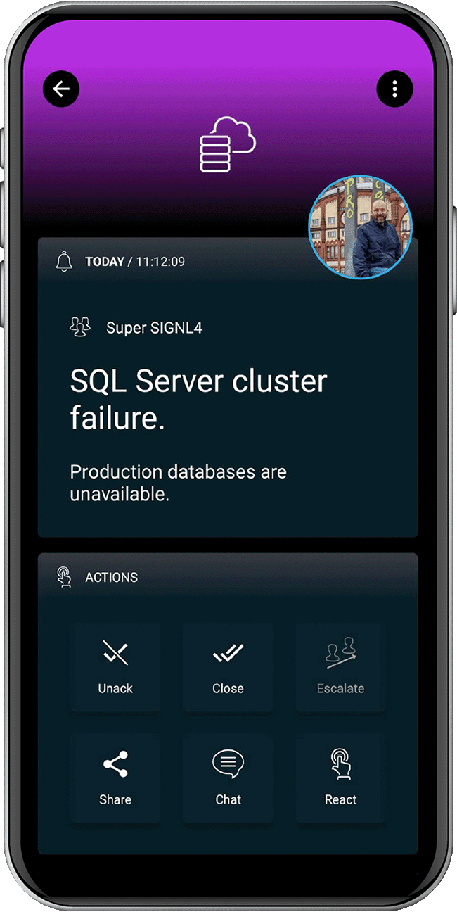

# SIGNL4 Integration with Nagios

Mobile workers are not able to sit in front of a [Nagios](https://www.nagios.com/) dashboard and actively monitor problems. SIGNL4 enables Nagios to notify the mobile teams in the field or on call in real-time. This speeds up their response significantly and frees resources in the operations.

Derdack provides a dedicated Plugin for Nagios [here](https://exchange.nagios.org/directory/Plugins/Notifications/SIGNL4-%E2%80%93-IT-On-2DCall-Alerting-and-Duty-Scheduling/details).

Just go ahead, download the plugin from there and follow the instructions on the page.

The alert in SIGNL4 might look like this.

