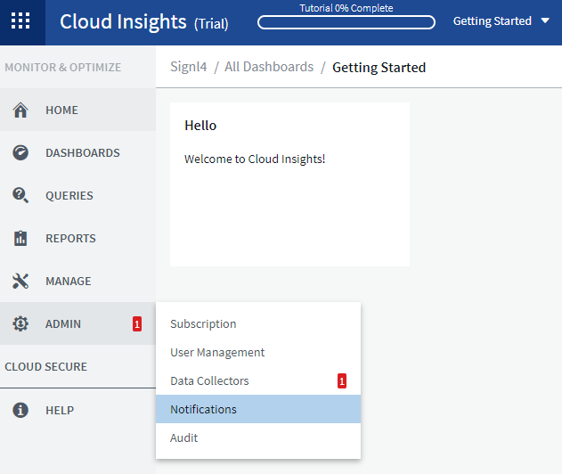
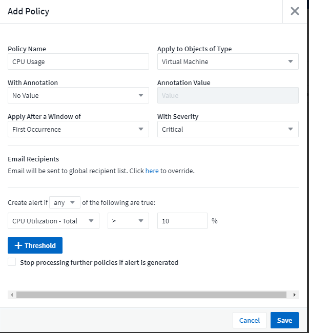
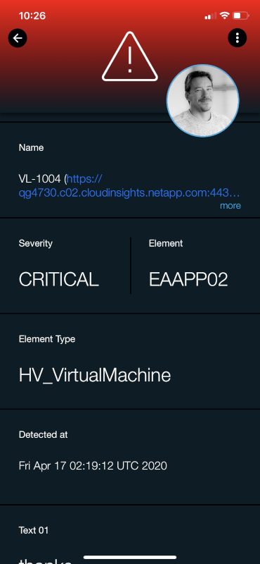

# SIGNL4 Integration with NetApp Cloud Insights

[Net App Cloud Insights](https://cloud.netapp.com/cloud-insights) is a hybrid monitoring service capable of monitoring not only on-prem servers but also Azure and AWS installations. Performance monitors are easy to configure, and notifications channels are configured with just a few clicks.  SIGNL4 ensures that all on duty members receive, acknowledge and resolve critical alerts, all from their smartphones. With persistent notifications and escalation chains there will never be a critical alert that goes unattended. SIGNL4 also offers ad-hoc collaboration between team members for each alert, so Subject Matter Experts can be looped in to help resolve issues.

In our example we are using Net App Cloud Insights to monitor the performance of Azure Virtual Machines.  The on-duty team members will be alerted via Push, SMS and Voice from the email generated within Cloud Insights.

SIGNL4 is a mobile alert notification app for powerful alerting, alert management and mobile assignment of work items.  Get the app at [https://www.signl4.com](https://www.signl4.com/)

## Prerequisites

- A SIGNL4 ([https://www.signl4.com](https://www.signl4.com/)) account
- A Net App Cloud Insights ([https://cloud.netapp.com/cloud-insights](https://cloud.netapp.com/cloud-insights)) account

## How to Integrate

First, we need to make sure the alerts are notified to the SIGNL4 team.

From the Left Navigation Panel, select ADMIN and choose Notifications.

Input the team specific SIGNL4 email address as shown below.

Set the alert policies to alert on first occurrence.

The next time the threshold is breached an email will be sent out to the SIGNL4 team.

