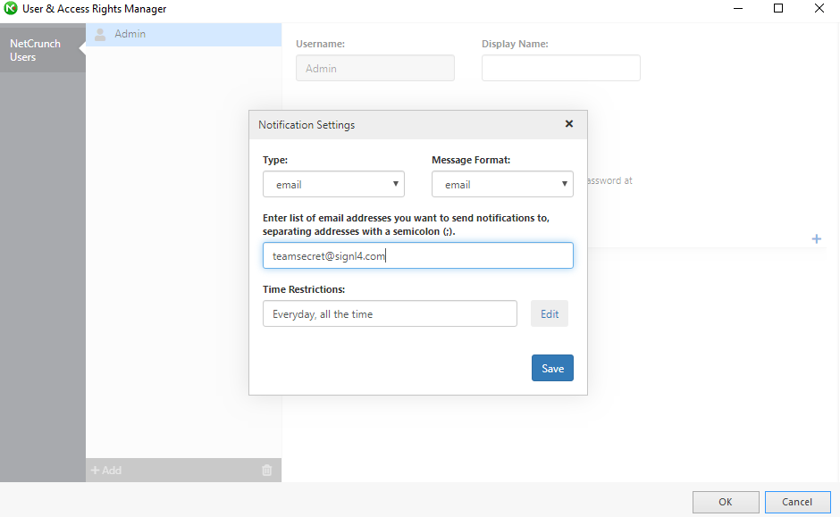
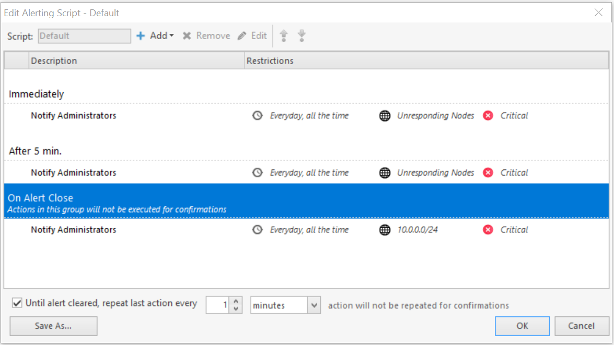
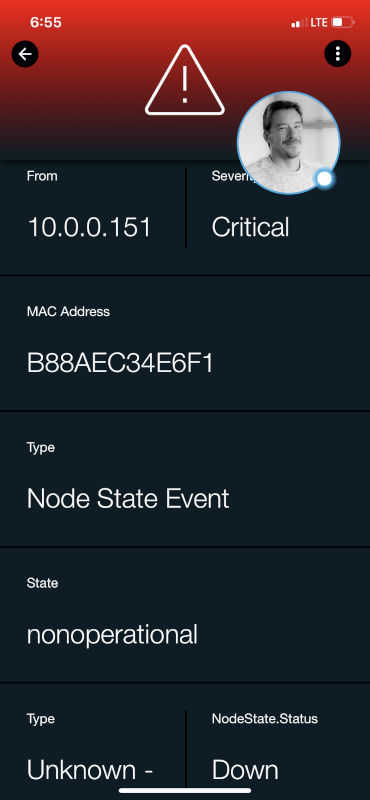

# SIGNL4 Integration with NetCrunch

[NetCrunch](https://www.adremsoft.com/) is a monitoring solution that can send out alerts to incidents that are created, but all too often the emails that are sent from critical events are missed. SIGNL4 ensures that all on duty members receive, acknowledge and resolve those critical alerts, all from their smartphones. With persistent notifications and escalation chains there will never be a critical alert that goes unattended. SIGNL4 also offers ad-hoc collaboration between team members for each and every alert, so Subject Matter Experts can be looped in to help resolve issues.

In our example we are sending incident information from NetCrunch to our SIGNL4 team by directing communication to a user with the unique team email address.

SIGNL4 is a mobile alert notification app for powerful alerting, alert management and mobile assignment of work items.  Get the app at [https://www.signl4.com](https://www.signl4.com/)

## Prerequisites

- A SIGNL4 ([https://www.signl4.com](https://www.signl4.com/)) account
- A NetCrunch ([https://www.adremsoft.com/](https://www.adremsoft.com/)) account

## How to Integrate

First, we need to make sure that the SIGNL4 email address is assigned to a user. In our example, we have added the SIGNL4 email address to the Admin user. Alert policy rules within NetCrunch can automatically route incidents to a specific user and since the SIGNL4 team email address is entered here, the entire team will receive the alerts.

In our account we ensured that the admin would receive all alerts by going to Monitoring > Alert Escalation Scripts. In the Default configured setting we see the Admin will get all alerts sent via email.

What would normally be sent as an email will now raise alerts via push, sms and voice calls to an entire team or to the specific on-call duty member.

With SIGNL4’s Services & Systems team members can opt in/out of specific categories related to the alerts that are raised.  Click [here](https://www.signl4.com/blog/mobile-alert-routing-user-groups/) for more details.

