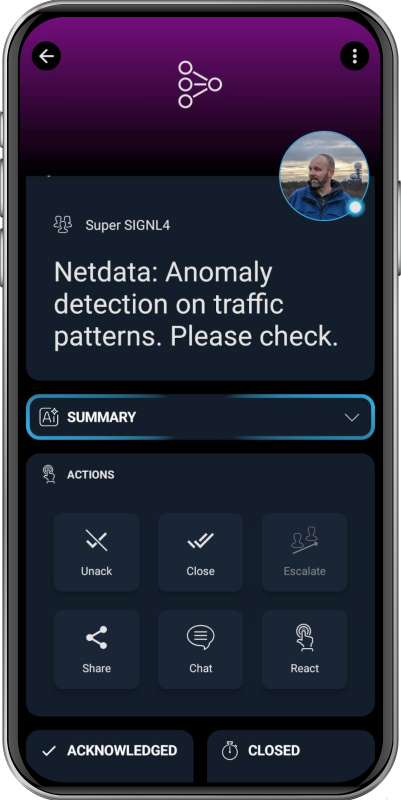

# SIGNL4 Integration with Netdata

[Netdata](https://www.netdata.cloud/) is a real-time observability platform for infrastructure, containers, applications, and hardware. It provides per-second metrics, automated dashboards, AI/ML-based anomaly detection, alerting, and log management, and it scales to large environments without requiring all data to be centralized.

SIGNL4 enhances Netdata with reliable mobile alerting, including a mobile app, push notifications, SMS messages, voice calls, automated escalations, and on-call scheduling. SIGNL4 ensures that critical alerts reach the right people reliably – anytime, anywhere.

## Prerequisites
A SIGNL4 (https://www.signl4.com) account
A Netdata (https://www.netdata.cloud/) instance

## How to Integrate

Integrating SIGNL4 with Netdata is straightforward. Here’s how it works.

### Web UI

In the Netdata web portal, go to Settings -> Alerts & Notifications. Add a new configuration and select SIGNL4. In the displayed SIGNL4 dialog, simply enter your SIGNL4 team or integration secret and save the configuration.

### Terminal

Alternatively, you can configure the integration from the terminal on the system where the Netdata Agent is running.

#### Configuration Options

The following options can be defined for this notification.

| Option | Description | Default | Required |
| -- | -- | -- | -- |
|SEND_SIGNL4 | Set SEND_SIGNL4 to YES |	YES | yes |
| SIGNL4_WEBHOOK_URL | set SIGNL4_WEBHOOK_URL to your SIGNL4 webhook URL. | | yes |

#### Via File

The configuration file name for this integration is health_alarm_notify.conf.

You can edit the configuration file using the edit-config script from the Netdata config directory.

```bash
cd /etc/netdata 2>/dev/null || cd /opt/netdata/etc/netdata
sudo ./edit-config health_alarm_notify.conf
```

This is an example for a basic configuration.

```bash
SEND_SIGNL4="YES"
SIGNL4_WEBHOOK_URL="https://connect.signl4.com/webhook/xxxxxxxx"
```

That's it.

You can find more information on how to configure SIGNL4 mobile alerting in Netdata [here](https://learn.netdata.cloud/docs/alerts-&-notifications/notifications/agent-dispatched-notifications/signl4).

The alert in SIGNL4 might look like this.



