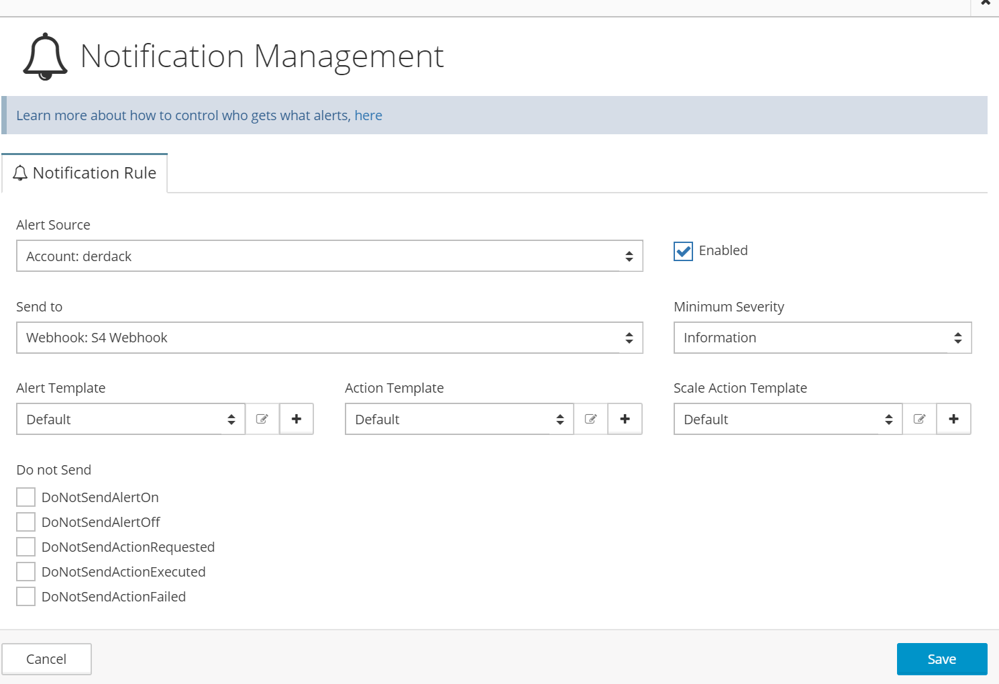

# SIGNL4 Integration with Netreo

[Netreo](https://www.netreo.com/) is a hybrid monitoring service capable of monitoring not only on-prem servers but also Azure and AWS installations. Performance monitors are easy to configure, and notification channels are configured with just a few clicks.  SIGNL4 ensures that all on-duty members receive, acknowledge and resolve critical alerts, all from their smartphones. With persistent notifications and escalation chains there will never be a critical alert that goes unattended. SIGNL4 also offers ad-hoc collaboration between team members for each alert, so Subject Matter Experts can be looped in to help resolve issues.

First we need to establish a connection to S4 using a webhook. Detailed steps to setup Webhook integration as follows:

Navigate to Integrations screen and create a new Webhook Integration.

Specify URL endpoint for target webhook.

Specify web method to use for this endpoint (POST).

Now, the last step is to tell Netreo what notifications and from what resources need to be published to this custom Webhook. Navigate to Notifications screen under Account Settings in Netreo and create a new notification rule that sends notifications from resources to your newly defined SIGNL4 Webhook.

The alert in SIGNL4 might look like this.

