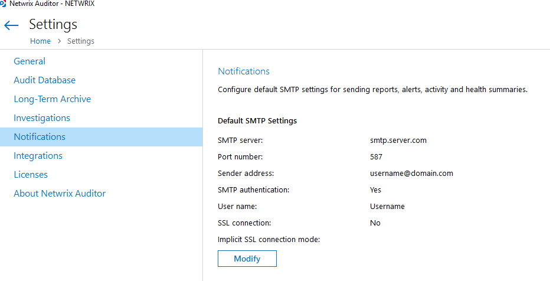
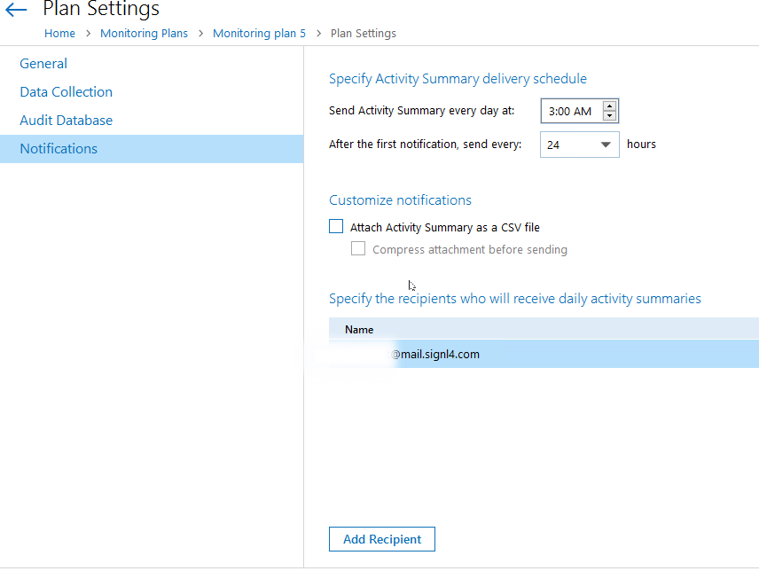
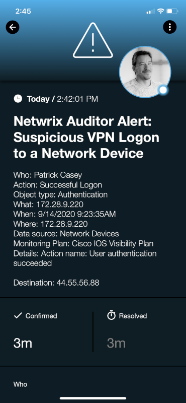

# SIGNL4 Integration with Newrix

Netwrix is an IT security software company that develops change management software to help companies with security and compliance auditing.  Netwrix alerts can be forwarded via email and email-based SMS messages. These tools are useful however for critical alerting that needs immediate attention in the middle of the night is where SIGNL4 comes in.  Data breaches, security violations and potential mission critical threats are identified sooner and resolved quicker, reducing downtime, and saving money! Persistent notifications and tier escalation within SIGNL4 ensures that critical alarms are not missed. Issues are taken beyond the dashboard and inbox and delivered vis Push, SMS, and Voice.

In our example we are forwarding a Netwrix alert to our SIGNL4 account.  Details about the alert will be sent immediately to the SIGNL4 to quickly notify users of the problem.

SIGNL4 is a mobile alert notification app for powerful alerting, alert management, and mobile assignment of work items.  Get the app at [https://www.signl4.com](https://www.signl4.com/)

## Prerequisites

- A SIGNL4 ([https://www.signl4.com](https://www.signl4.com/)) account
- A Netwrix ([https://www.netwrix.com/](https://www.netwrix.com/)) account

## How to Integrate

First lets setup the SMTP server settings. Populate the Notifications settings for your environment.  An example is below.

You will need to add a recipient to the Monitoring Plan > Notification section. This recipient will contain your team specific email address.

It’s as easy as that! The next time this alert is raised, an email will be sent to the SIGNL4 team – raising notifications via push, SMS and voice call to all on-duty team members.

