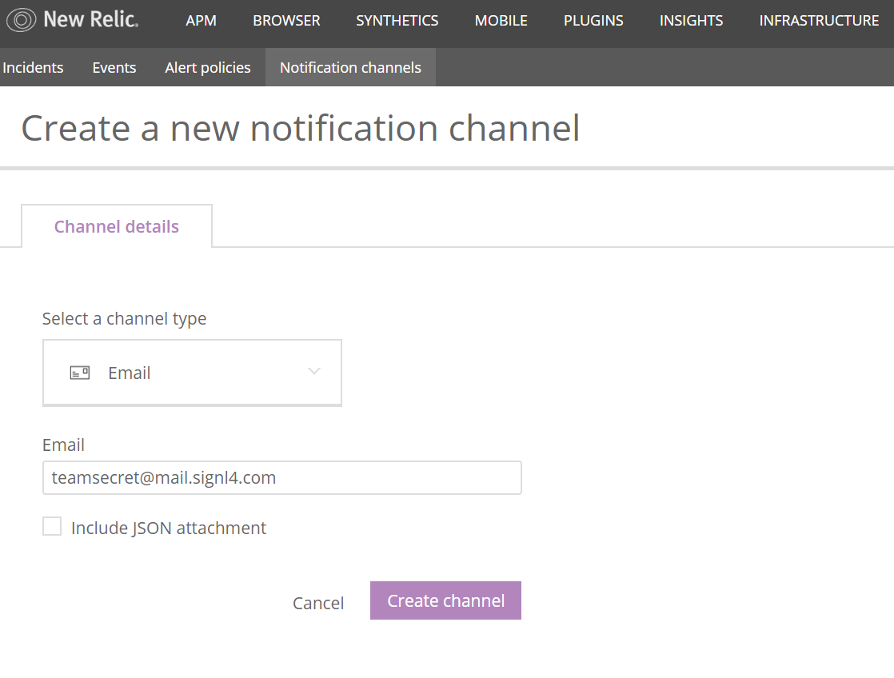
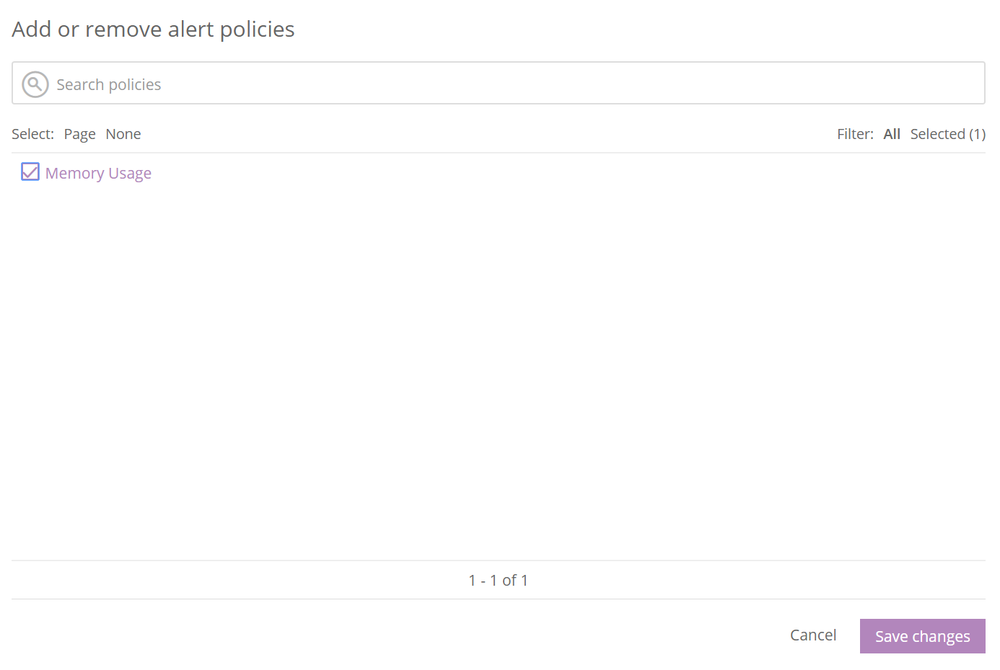
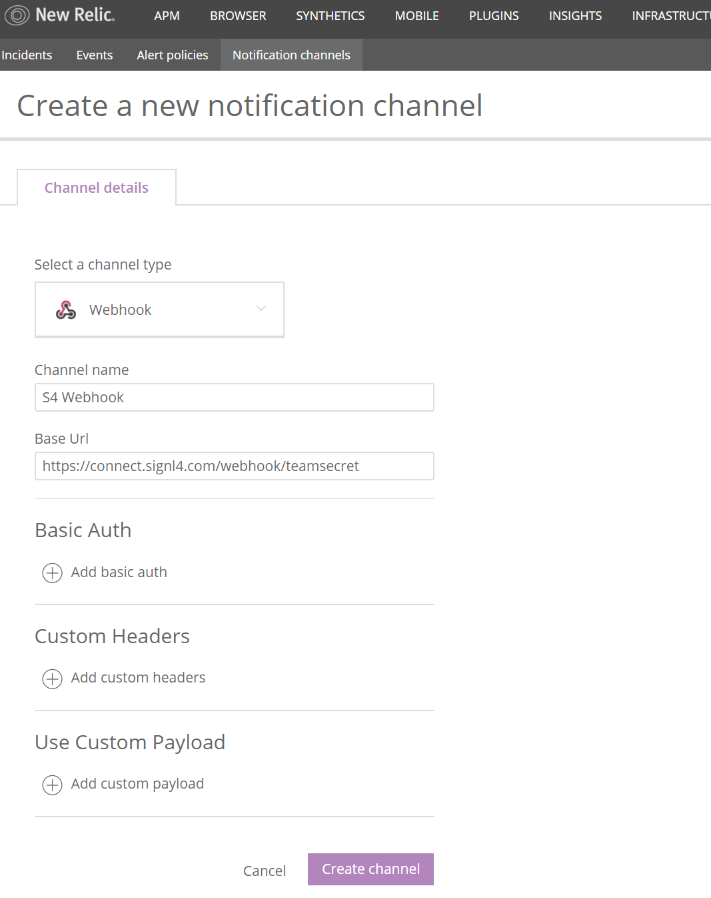

# SIGNL4 Integration with New Relic

[New Relic](https://newrelic.com/) Infrastructure gives you full visibility of your dynamic infrastructure, tracking your health metrics and changes in real-time.  SIGNL4 is a great compliment to this monitoring tool because unless you are sitting at the service desk, critical alerts can be missed.  Integrating SIGNL4 puts those critical alerts in the palm of your hand, no matter where you are.  Instantly be alerted via your smart phone when a problem arises.

Pair New Relic and SIGNL4 with a simple webhook or email integration to unlock SIGNL4 alerting capabilities.

Start by creating a new Notification channel.  SIGNl4 can be setup as a notification channel via email and webhook.

## Setup via Email

1. Add new notification channel
2. Select Email
3. Enter in SIGNL4 email address and click Save
4. On the Alert Policies Tab, select which alert policies you wish to send notifications to SIGNL4

## Setup via Webhook

1. Add new notification channel
2. Select Webhook
3. Enter in SIGNL4 webhook URL and click Save
4. On the Alert Policies Tab, select which alert policies you wish to send notifications to SIGNL4

The alert in SIGNL4 might look like this.

