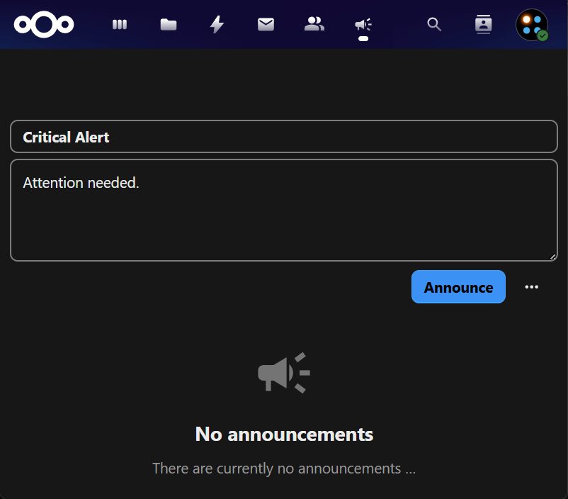

# SIGNL4 Integration with Nextcloud

[Nextcloud](https://nextcloud.com/) is an open-source platform that lets you securely store, share, and sync files across devices.
It offers collaboration tools like calendars, contacts, and document editing while keeping full control over your data.

SIGNL4 adds reliable mobile alerting to Nextcloud with features like mobile app, push notifications, SMS messaging, voice calls, automated escalations, and on-call duty scheduling. SIGNL4 ensures that critical alerts reliably reach the responsible personnel – anytime, anywhere.

## Prerequisites
A SIGNL4 (https://www.signl4.com) account
A Nextcloud (https://nextcloud.com/) instance

## How to Integrate

There are several ways to integrate SIGNL4 with Nextcloud. In the example below, we demonstrate how to set up the integration using the Announcement Center.

The Announcement Center allows you to send messages to specific user groups, such as administrators. These announcements can be delivered through Nextcloud notifications or via email.

First, ensure that the Announcement Center app is installed and that Nextcloud is properly configured to send emails.

Next, create a user account for SIGNL4 using your SIGNL4 email address (e.g., xxxxxxxx@mail.signl4.com). Add this user account to the group you want to send the announcements to, for example, "admin".

Once configured, every time an announcement is sent to that group, an email will also be sent to the SIGNL4 email address. This email will automatically trigger a SIGNL4 alert.

The alert in SIGNL4 might look like this.

