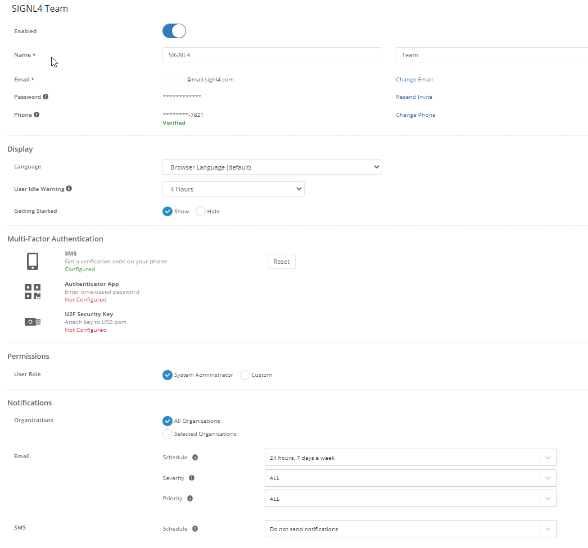
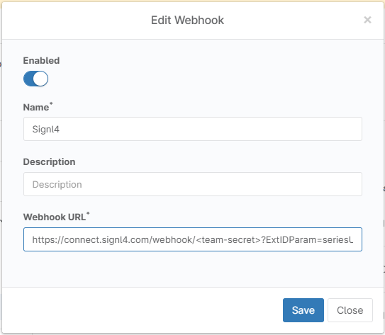

# SIGNL4 Integration with NinjaOne

[NinjaOne](https://www.ninjarmm.com/) provides intuitive endpoint management software to managed service providers (MSPs) and IT professionals.  The dashboards provide a single pane of glass for all devices running agents in your infrastructure.  NinjaOne alerts can be forwarded via email and through their API.  These tools are useful however for critical alerting that needs immediate attention in the middle of the night is where SIGNL4 comes in.  Data breaches, security violations and potential mission critical threats are identified sooner and resolved quicker, reducing downtime, and saving money! Persistent notifications and tier escalation within SIGNL4 ensure that critical alarms are not missed. Issues are taken beyond the dashboard and inbox and delivered vis Push, SMS, and Voice.

In our example we are forwarding a NinjaOne alert of a print spooler being down to our SIGNL4 account.  Details about the alert will be sent immediately to the SIGNL4 to quickly notify users of the problem.

SIGNL4 is a mobile alert notification app for powerful alerting, alert management, and mobile assignment of work items.  Get the app at [https://www.signl4.com](https://www.signl4.com/)

## Prerequisites

- A SIGNL4 ([https://www.signl4.com](https://www.signl4.com/)) account
- A NinjaOne ([https://www.ninjaone.com](https://www.ninjaone.com/)) account

## Integration via Email

To start this integration, we setup a VM on the Azure network and then installed the Agent provided by NinjaOne.

Immediately we started to see the server metrics. We are using the preconfigured Print Spooler policy to trigger alerts.



The first integration method was via email. We created a user within NinjaOne and gave this user the SIGNL4 team specific email address.  Configuring the user to receive all alerts regardless of severity.



## Integration via Webhook

In order to configure the webhook integration with SIGNL4 please go to your NinjaOne Portal and then to Administration -> Notification Channels. Here click Add to add a new Webhook and to configure it accordingly.

The Webhook URL should be the following:

```
https://connect.signl4.com/webhook/?ExtIDParam=seriesUid&ExtStatusParam=statusCode&ResolvedStatus=RESET
```

Where is your team or integration secret. This URL will make sure that NinjaOne can not only trigger alerts but also close them when the status is OK again.

The alert in SIGNL4 might look like this.


