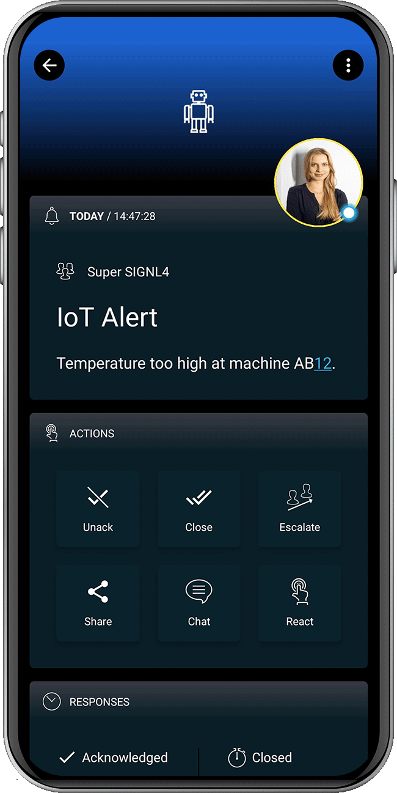

# SIGNL4 Integration with Node-RED

[Node-RED](https://nodered.org/) is a flow-based development tool for visual programming for wiring together hardware devices, API’s, and online services with IoT applications. Node-RED provides a web browser-based flow editor, which can be used to create JavaScript functions. It is shipped with some variants of Raspbian, the operating system of Raspberry Pi. Integrating SIGNL4 with Node-RED can enhance your daily operations with an extension to your mobile team in the field or on the shop floor.

Gathering events from IoT devices and sending team alerts in case of critical incidents is a rather vast field. It can involve simple prototypes using a Raspberry Pi and can work up to industrial IoT scenarios, machine data or distributed systems in the field, and even IT operations.

SIGNL4 is a mobile alert notification app for powerful alerting, alert management and for mobile assignment of work items. Get the app at [https://www.signl4.com](https://www.signl4.com/).

Node-RED offers an easy-to-use workflow designer. The integration with SIGNL4 is straightforward.

## Prerequisites
- A [SIGNL4](https://www.signl4.com/) account
- Node-RED (download at [https://nodered.org](https://nodered.org/) or use it directly on your Raspberry Pi if available)

## SIGNL4 Nodes

SIGNL4 provides [Node-RED nodes](https://flows.nodered.org/node/node-red-contrib-signl4) for triggering and closing alerts.

You can inset them in your flow and configure them accordignly. You can find more information [here](https://flows.nodered.org/node/node-red-contrib-signl4). There are also some [sample flows](https://flows.nodered.org/search?term=signl4&type=flow) available.

## Two-Way Status Updates and Remote Actions

For handling alert status updates coming from SIGNL4's outbound webhook or for remote actions you can use the "http in" in Node-RED to receive the respective HTTP requests.

The alert in SIGNL4 might look like this.

