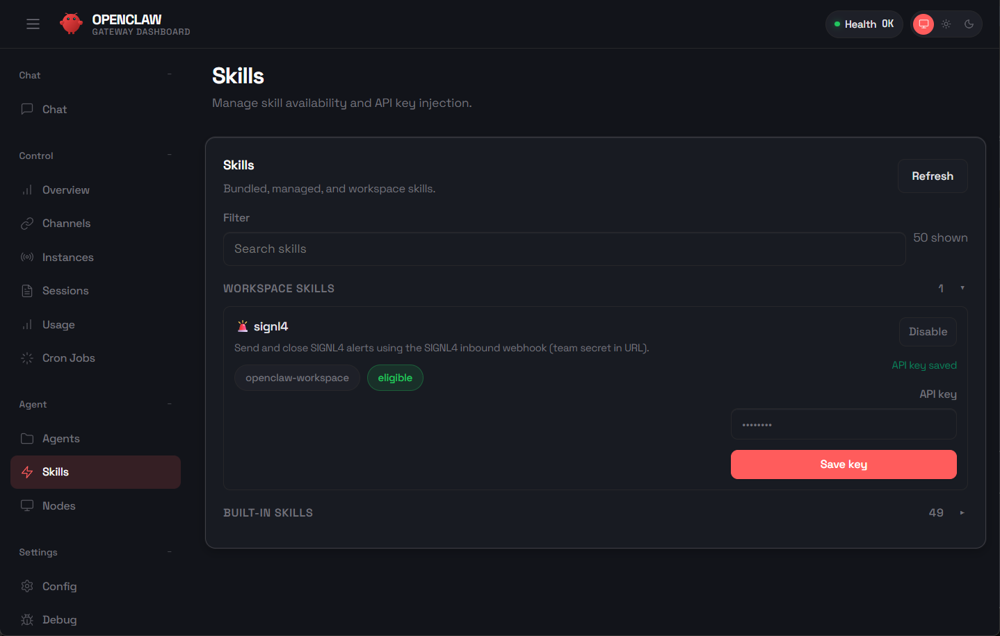

# SIGNL4 Integration with Netdata

[OpenClaw.ai](https://openclaw.ai/) is a free, open-source, self-hosted AI assistant that runs on your own hardware and lets you interact with and control it through your existing messaging apps (like WhatsApp, Telegram, Discord, Slack, iMessage, Signal, etc.) to automate tasks, manage workflows, and execute actions on your system.

SIGNL4 enhances OpenClaw with reliable mobile alerting, including a mobile app, push notifications, SMS messages, voice calls, automated escalations, and on-call scheduling. SIGNL4 ensures that critical alerts reach the right people reliably – anytime, anywhere.

## Prerequisites
- A SIGNL4 (https://www.signl4.com) account
- An OpenClaw (https://openclaw.ai/) instance

## How to Integrate

Integrating SIGNL4 with OpenClaw is straightforward. Here’s how it works.

SIGNL4 is available as a Skill in OpenClaw. You can find it at [clawhub.ai](https://clawhub.ai/rons4/signl4).

You can use the following command line to install the SIGNL4 skill:

```bash
npx clawhub install signl4
```

The skill in the OpenClaw web portal looks like this.



You just need your SIGNL4 team or integration secret. Please note that this it **not** the API Key of the SIGNL4 REST API.

This is all. Now you OpenClaw can use the SIGNL4 skill to trigger alerts or to close alerts again.

Here are some sample prompts:

Send a SIGNL4 alert:

```text
Please send a SIGNL4 alert to report that server A2 is down. Use Server-A2 as external ID.
```

Close the alert again:

```text
Please close the previously sent SIGNL4 alert again.
```

The alert in SIGNL4 might look like this.


