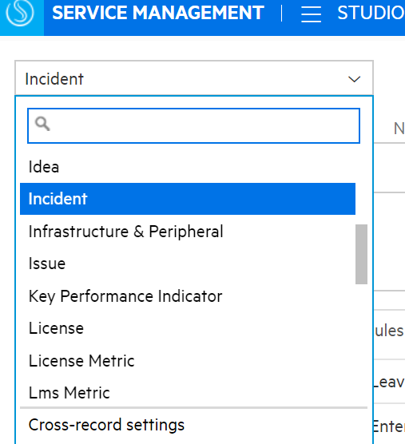
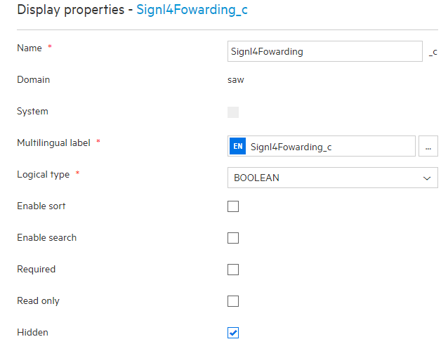
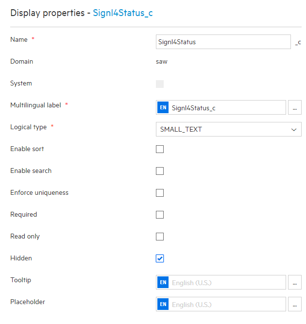
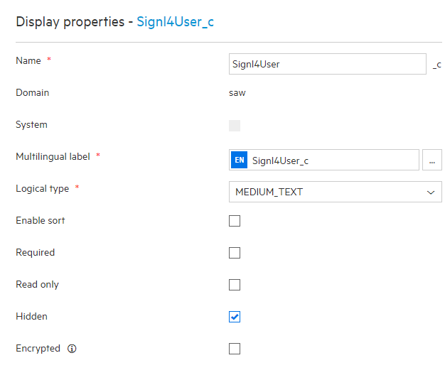
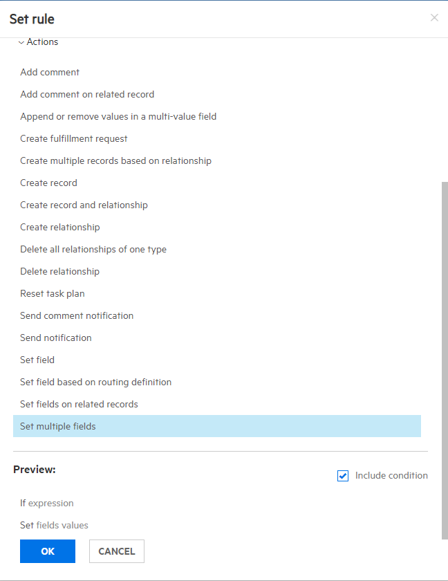
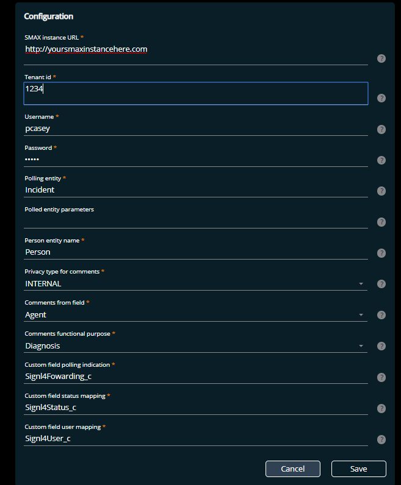
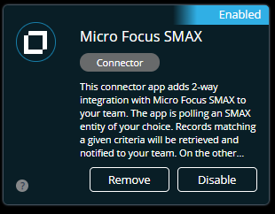
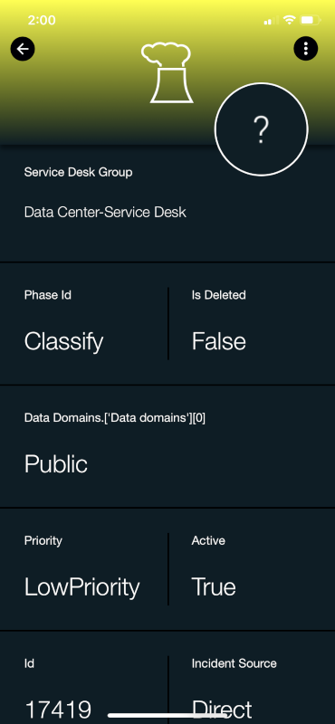
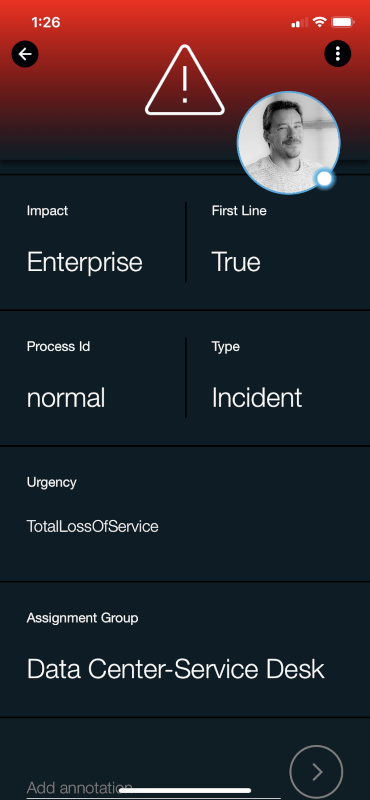
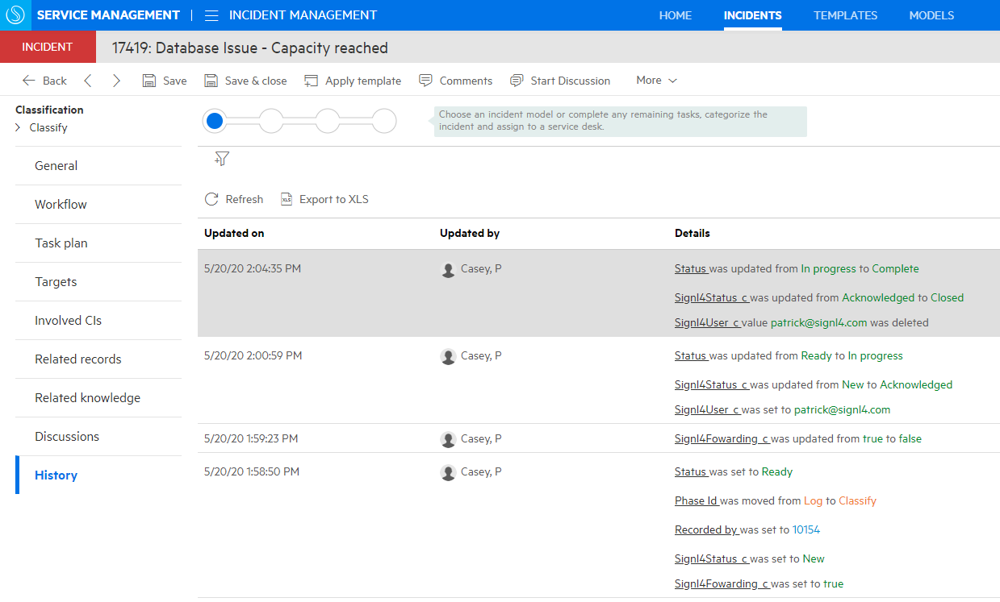

# SIGNL4 Integration with OpenText SMAX

[Service Management Automation X](https://www.microfocus.com/en-us/products/service-management-automation-suite/overview) (SMAX) is a ticket based ITSM that can send out alerts to incidents that are created, but all too often the emails that are sent from critical events and service tasks are missed. SIGNL4 ensures that all on duty members receive, acknowledge and resolve those critical alerts, all from their smartphones. With persistent notifications and escalation chains there will never be a critical alert that goes unattended. SIGNL4 also offers ad-hoc collaboration between team members for each and every alert, so Subject Matter Experts can be looped in to help resolve issues.

This connector app adds 2-way integration with Micro Focus SMAX to your team. The app is polling an SMAX entity of your choice. Records matching a given criteria will be retrieved and notified to your team. On the other hand, the app can update the record when Signls are acknowledged, closed or annotated.

In our example we are going to use the SIGNL4 connector app to poll incidents created within SMAX.  This will alert all team members on duty via Push, SMS and Voice notifications.   Upon Acknowledging the SIGNL SMAX will update the incident status.SIGNL4 is a mobile alert notification app for powerful alerting, alert management and mobile assignment of work items.  Get the app at [https://www.signl4.com](https://www.signl4.com/).

In the SMAX Studio (Administration -> Studio), select an entity that you wish to receive notifications for. In example, if you want to be notified about certain incidents in SMAX, select ‘Incident’.



Create three custom fields on that entity. Make sure the multilingual label matches the name field. Also, make sure to check the Hidden option.  After all three are added click Save.

- Signl4Fowarding_c, BOOLEAN
- Signl4Status_c, SMALLTEXT
- Signl4User_c, MEDIUMTEXT







On the same entity, click on ‘Processes and Rules’ and add a new workflow rule for the ‘After change’ event.

It ensures that according records are retrieved by SIGNL4. The rule criteria is up to you. The rule action is the manipulation of multiple entity fields. Specifically, Signl4Fowarding_c will be set to True, which causes an according entity instance to be received by the app. Signl4Status_c must get the value ‘New’.

Expand the ‘After change’ event and click ‘Add’, then select ‘If..then rule’. In the screen that appears, select ‘Set multiple fields’ and then click OK. Now use the hyperlinks in the rule that has been created for you, in order to set rule criteria and actions as explained earlier.

At the end, your new rule should look as follows:

## Trigger new Signl in SIGNL4

```
If
${current_update.Status.IsChanged && current_update.Status.NewValue!=null && current_update.Status.NewValue == ‘Ready’}
Set
Signl4Status_c: New
Signl4Fowarding_c: true
```

Create another workflow rule for the ‘After change’ event using the same approach as in the previous step. This rule will update according records in SMAX, when corresponding Signls in SIGNL4 have been acknowledged. The field Signl4Status_c will be updated by the connector app with the new status of the corresponding Signl. The field Signl4User_c will contain the email of the team member who has acknowledged the Signl and can be used in the rule to e.g. assign an owner. An example looks as follows:

## Update Status when Signl is acknowledged in SIGNL4

```
If
${current_update.Signl4Status_c.IsChanged && current_update.Signl4Status_c.NewValue!=null && current_update.Signl4Status_c.NewValue == ‘Acknowledged’}
Set
Status: InProgress
OwnedByPerson: ${identification.identify(‘Person’, ‘Upn’, entity.Signl4User_c)}
```

Create a third workflow rule which updates the record when the corresponding Signl is closed along to the previously created rule. An example looks as follows:

## Update Status when Signl is closed in SIGNL4

```
If
${current_update.Signl4Status_c.IsChanged && current_update.Signl4Status_c.NewValue!=null && current_update.Signl4Status_c.NewValue == ‘Closed’}
Set
Status: Complete
Signl4User_c: ${identification.identify(‘Person’, ‘Upn’, entity.Signl4User_c)}
```

## Configuration of the app in SIGNL4

Reading records and updating their status requires the above setup in SMAX. Adding mobile chat messages as comments to those records is done by the app itself without workflow logic in SMAX.

It defines the entity in SMAX that is being polled. Polling is then based on the boolean value of that entity’s custom field, configured in ‘Custom field polling indication’: If it’s value changes to true, it will be polled by this app which does then ‘acknowledge’ receipt by setting its value back to false.



Access the Microfocus SMAX connector from the SIGNL4 Web: [https://account.signl4.com/manage/Apps](https://account.signl4.com/manage/Apps)

Enter the values that pertain to your environment



Click Save and when enabled you should see the app connector show a blue status of enabled.



Now when a new Incident is created within SMAX, SIGNL4 will notify on-duty team members.





When an alert is acknowledged the status of incident changes from New to Acknowledged.  Furthermore, when the alert is closed the status will change from Acknowledged to Closed.  This provides 2-way communication.



Please feel free to check out our video:

<iframe width="560" height="315" src="https://www.youtube.com/embed/0CoQg-8fgjo?si=g3qEtxTmFt9_VCH3" title="YouTube video player" frameborder="0" allow="accelerometer; autoplay; clipboard-write; encrypted-media; gyroscope; picture-in-picture; web-share" referrerpolicy="strict-origin-when-cross-origin" allowfullscreen></iframe>
