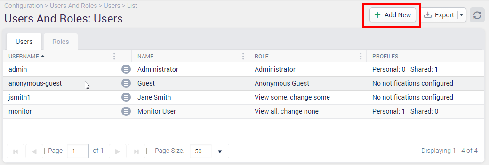
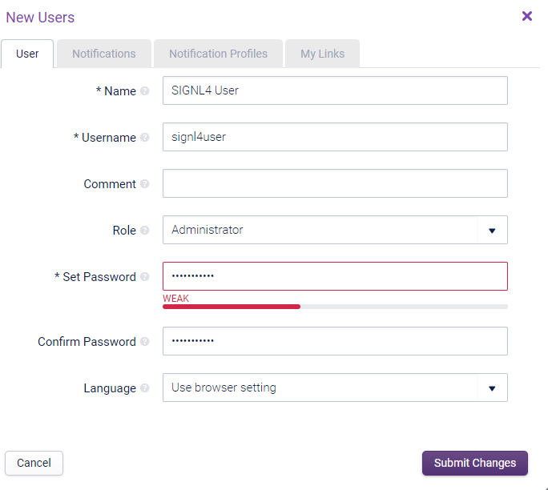
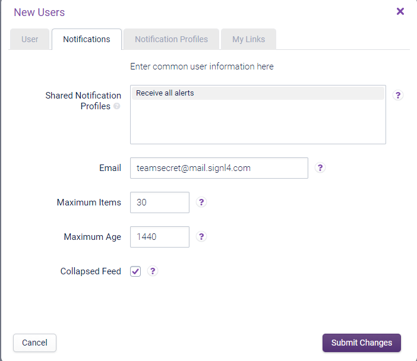
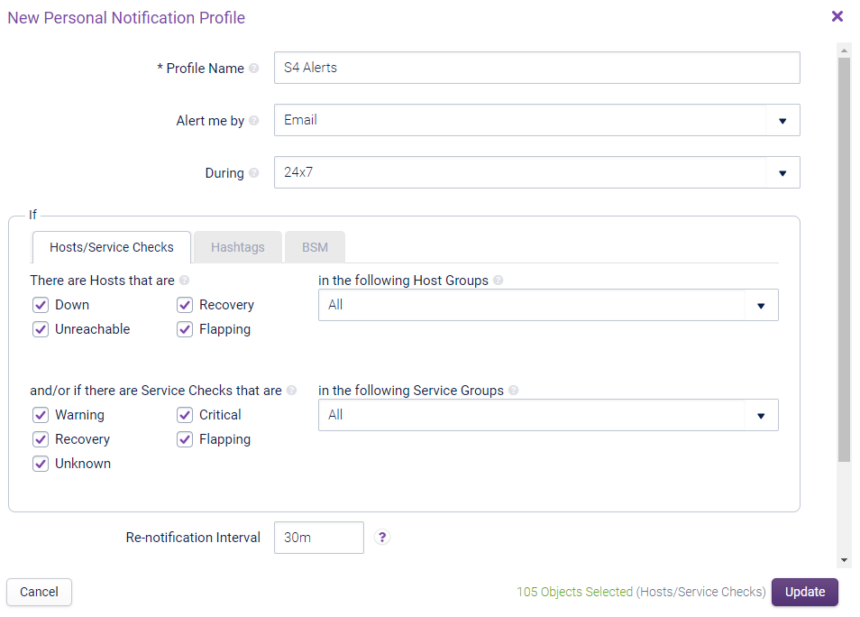
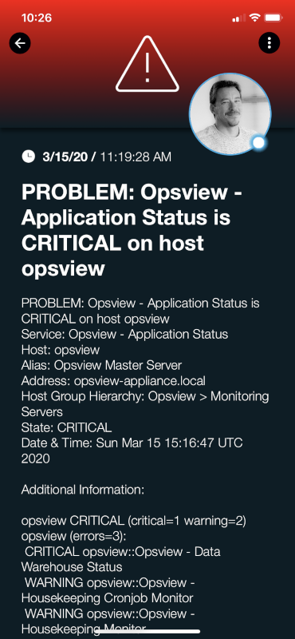

# SIGNL4 Integration with Opsview

[Opsview](https://www.opsview.com/) can send out alerts, but all too often the emails that are sent from critical events are missed. SIGNL4 ensures that all on duty members receive, acknowledge and resolve those critical alerts, all from their smartphones. With persistent notifications and escalation chains there will never be a critical alert that goes unattended. SIGNL4 also offers ad-hoc collaboration between team members for each and every alert, so Subject Matter Experts can be looped in to help resolve issues.

In our example we are sending incident data from Opsview to our SIGNL4 team by directing communication to a user with the unique team email address.

SIGNL4 is a mobile alert notification app for powerful alerting, alert management and mobile assignment of work items.  Get the app at [https://www.signl4.com](https://www.signl4.com/)

## Prerequisites

- A SIGNL4 ([https://www.signl4.com](https://www.signl4.com/)) account
- An Opsview ([https://www.opsview.com/](https://www.opsview.com/)) account

## How to Integrate

We first need to add a new user within Opsview with the SIGNL4 email address. To add a new User, click on the ‘Add New’ button.

Once clicked, this button will display the ‘New User’ configuration window.

On the Notifications tab add in the SIGNL4 email address. This ensures that all alerts directed to this user will raise a signal to the entire SIGNL4 team.

On the Notification Profiles section indicate which alerts the SIGNL4 team should receive. Clicking Save/Update will put these changes in place.

At this point the next time any of the alerts selected in the profile are triggered, the SIGNL4 team will receive these alerts.  The benefit here is that users will not just receive an email.  They will be alerted no matter where they are using SIGNL4 push, SMS and Voice capabilities.

