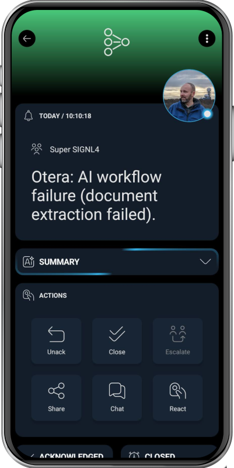

# SIGNL4 Integration with Otera

[Otera](https://www.otera.ai/) is an enterprise AI platform focused on "agentic automation". It uses autonomous AI agents to execute complex business workflows – especially those involving unstructured data like documents – end-to-end. The system combines multiple AI models with auditability and control, enabling companies to automate mission-critical processes with high accuracy and oversight.

SIGNL4 extends Otera with reliable mobile alerting, including a mobile app, push notifications, SMS messages, voice calls, automated escalations, and on-call scheduling. SIGNL4 ensures that critical alerts reach the right people reliably – anytime, anywhere.

Typical alerts sent from Otera to SIGNL4 depend on the workflow, but common examples include:
- Process failures: An AI workflow cannot complete a task (e.g., document extraction failed or confidence too low)
- Data anomalies: Detected inconsistencies in invoices, contracts, or incoming data streams
- Integration errors: API calls to external systems fail or return unexpected results
- SLA breaches: A workflow step exceeds defined time limits
- Approval exceptions: High-risk or unclear cases that require human review
- System health issues: Downstream services or dependencies are unavailable

## Prerequisites
- A SIGNL4 (https://www.signl4.com/) account
- A Otera (https://www.otera.ai/) instance

## How to Integrate

Integrating SIGNL4 with Otera is straightforward. Here’s how it works.

In Otera’s Agentic Flow Builder, you add the SIGNL4 node, connect it with SIGNL4 credentials using your webhook team or integration secret, then choose an Alert operation:
- Send an alert or
- Resolve an alert

The team or integration secret is the last part of your SIGNL4 webhook URL, which Otera uses to authenticate and pass workflow data into SIGNL4 alerting.

That's it.

You can find more information on how to configure SIGNL4 mobile alerting in Otera [here](https://docs.otera.ai/docs/overview/agentic-flow-builder/nodes/app-nodes/signl4).

The alert in SIGNL4 might look like this.

