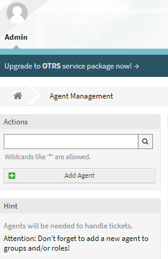
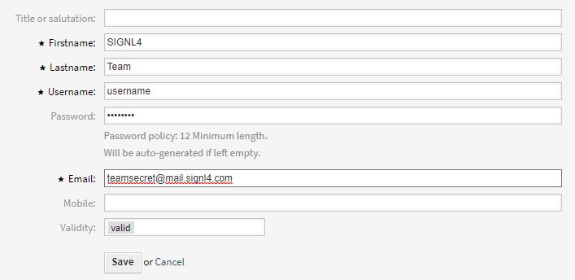
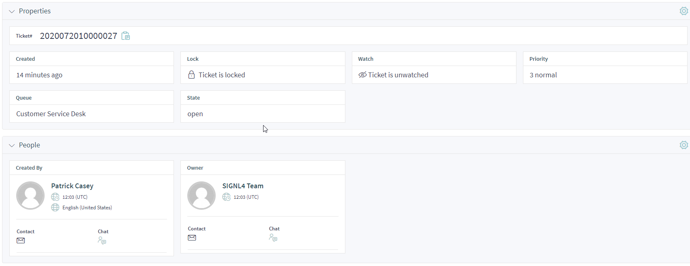

# SIGNL4 Integration with OTRS

[OTRS](https://otrs.com/) is a cloud-based ticketing and automation system. This tool is perfect for call centers and help desk to take incoming calls and log them in the portal.

SIGNL4 comes in is at the alerting level. SIGNL4 operates at the alerting layer, complementing OTRS. While OTRS can send emails to designated recipients when a new ticket is raised, SIGNL4 takes this a step further by transforming those emails into actionable alerts delivered to the right people at the right time. With features like mobile app push notifications, SMS messaging, automated escalations, and on-call duty scheduling, SIGNL4 ensures that critical alerts reliably reach the responsible personnel – anytime, anywhere.

## Prerequisites

- A SIGNL4 ([https://www.signl4.com](https://www.signl4.com/)) account
- An OTRS ([https://otrs.com/](https://otrs.com/)) instance

## How to integrate

## Option 1: Ready2Adopt Web Services

This option allows you to use a dedicated [Ready2Adopt Web Service](https://academy.otrs.com/doc/fao/ready2adopt-web-services/) for SIGNL4. It allows you to trigger and to close SIGNL4 alerts from the OTRS side.

**Note**: If you cannot find the Ready2Adopt Web Service for SIGNL4, please let us know. We can help.

As webhook URL you can use any existing inbound webhook URL already configured in SIGNL4 or you can create a new one dedicated for OTRS in the SIGNKL4 web portal by going to Integrations -> Gallery and install the OTRS (->) connector from there.

### Two-Way Integration

It is also possible to send status updates from SIGNL4 back to OTRS, e.g. when an alert in SIGNL4 has been acknowledged, annotated or closed. For this to work you need to configure the back-channel connector app for OTRS in SIGNL4. In the SIGNL4 web portal go to Integrations -> Gallery and look for the OTRS (<-) connector. Please note that the arrow points to the left. Here you configure your API URL, username and password. The other parameters are optional. You can find more information about the parameters by hovering over the (?) symbol. When ready, click Install and now status changes in SIGNL4 will reflect in the OTRS ticket.

## Option 2: Email

In this example we are going to forward OTRS tickets via email to the SIGNL4 email address.  This will alert all team members on duty via Push, SMS and Voice notifications.

In order to keep the current workflows and processes already set within OTRS, we are going to simply create a new user and designate the SIGNL4 team email address as the notification delivery address.

From the admin panel, select Add Agent.

Populate this user with the SIGNL4 team email address. For the purposes of forwarding ticket information, the username and password are not important but must be populated.  Be sure to enter the SIGNL4 team email address in the *Email field.

Now when the helpdesk takes an incoming call, they simply need to select the SIGNL4 Team as the user to be assigned to the ticket.  This will then notify all on-call team members of the new ticket.  They will receive the information entered in the ticket as well as a link to the ticket within the OTRS portal.

This will then send all tickets and raised alerts to the SIGNL4 team.

That's it!

The alert in SIGNL4 might look like this.

