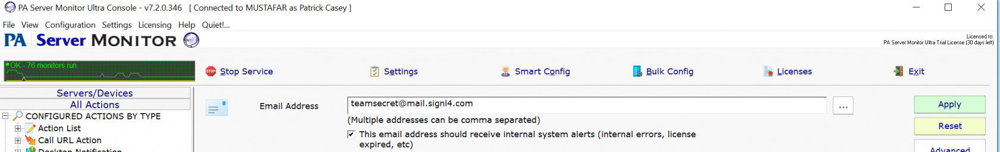
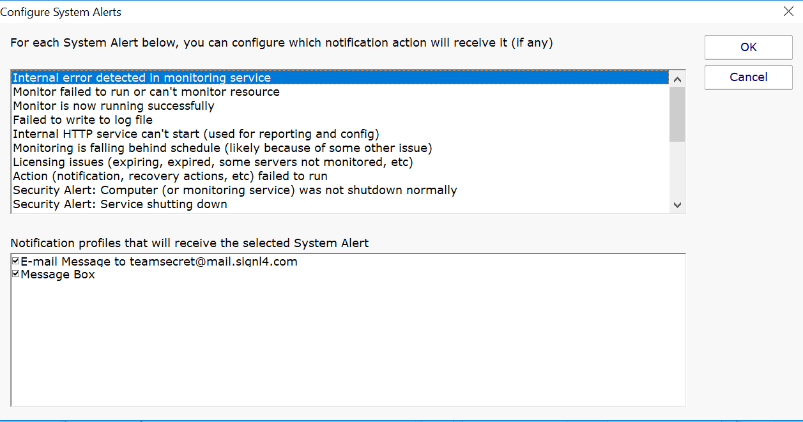
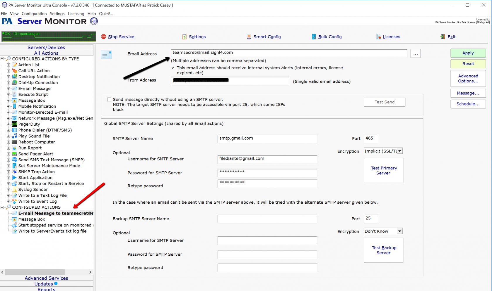

# SIGNL4 Integration with PA Server Monitor

[PA Server Monitor](https://www.poweradmin.com/products/server-monitoring/) is a server monitoring and network monitoring software application, developed by Power Admin LLC. The main function of the software is to monitor performance of servers and network devices in Windows and Linux environments. Data is kept on customers servers, and not stored in the cloud.

Under Configured Actions select Email message to.

Enter the SIGNL4 team email address.

Settings -> Configure System Alerts

Select which system alert you wish to be notified for and make sure the email address is checked in the notification profile at the bottom of the section.

The alert in SIGNL4 might look like this.

