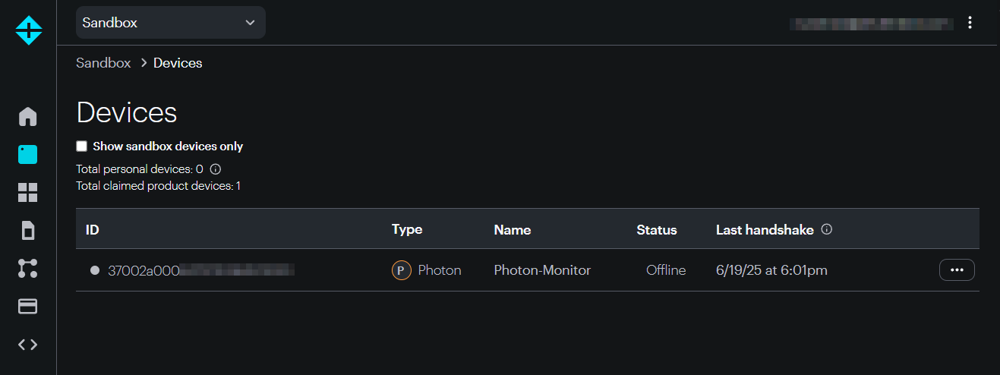
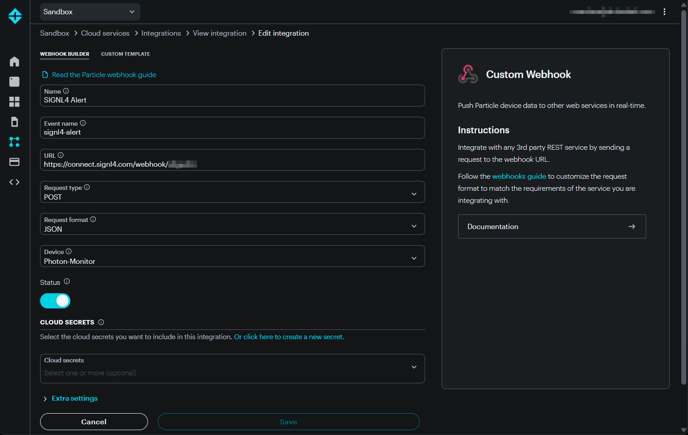
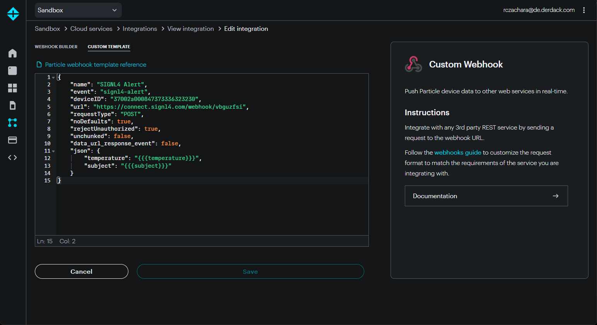

# SIGNL4 Integration with Particle

In our example we integrate a Particle Photon device with an IR motion sensor and a temperature sensor. Whenever a motion (e.g. an intruder) is detected we send an alert to our SIGNL4 team.

SIGNL4 is a mobile alert notification app for powerful alerting, alert management and mobile assignment of work items. Get the app at [https://www.signl4.com](https://www.signl4.com/).


## Prerequisites
- A SIGNL4 ([https://www.signl4.com](https://www.signl4.com/)) account
- An Particle ([https://console.particle.io](https://console.particle.io/)) account
- A Particle Maker Kit ([https://store.particle.io/collections/shields-and-kits](https://store.particle.io/collections/shields-and-kits))

In our case we use the Particle Maker Kit with a Photon device to connect an IR motion sensor ans a temperature sensor. We also use an LED to indicate the motion detection directly on the device.



You can see the assembled device on the image above. You can find a good description on how to connect the sensors here: [https://docs.particle.io/tutorials/hardware-projects/maker-kit](https://docs.particle.io/tutorials/hardware-projects/maker-kit).

Now you can connect your device to the Particle IoT platform. This is easily done by using the Particle app. You can find a full description here: [https://docs.particle.io/quickstart/photon](https://docs.particle.io/quickstart/photon).

Now you can see your new device in the Particle Console under Devices: [https://console.particle.io/devices](https://console.particle.io/devices).

In the Particle Console under Integrations ([https://console.particle.io/integrations](https://console.particle.io/integrations)) you can now create a new Webhook in order to send alerts to SIGNL4.

You can create a new Webhook and then use the SIGNL4 webhook URL.



The {team-secret} is your SIGNL4 team secret.

Under Custom Template you can insert your JSON data template as to be sent to SIGNL4.


```json
{
    “event”: “photon-motion”,
    “deviceID”: “37002a000847373336323230”,
    “url”: “https://connect.signl4.com/webhook/{team-secret}”,
    “requestType”: “POST”,
    “noDefaults”: true,
    “rejectUnauthorized”: true,
    “json”: {
        “subject”: “{{{subject}}}”,
        “temperature”: “{{{temperature}}}”
    }
}
```




You can now go to the Web IDE at [https://build.particle.io/build](https://build.particle.io/build) to deploy the code to your device(s).

The two main lines to send the SIGNL4 alert are the following.

```javascript
String data = “{ “subject”: “Motion detected.”, “temperature”: “” + temperature() + “” }”;

Particle.publish(“photon-motion”, data, 60, PUBLIC); 
```

First, we assemble the date to become part of the webhook JSON data. And second, we send the date to the “photon-motion” Webhook we have created above.

This is it. You can now test your IoT scenario by simulating a motion. You will then receive an alert in your SIGNL4 app.

You can find a sample in GitHub:  
[https://github.com/signl4/signl4-integration-particle](https://github.com/signl4/signl4-integration-particle)

The alert in SIGNL4 might look like this.


