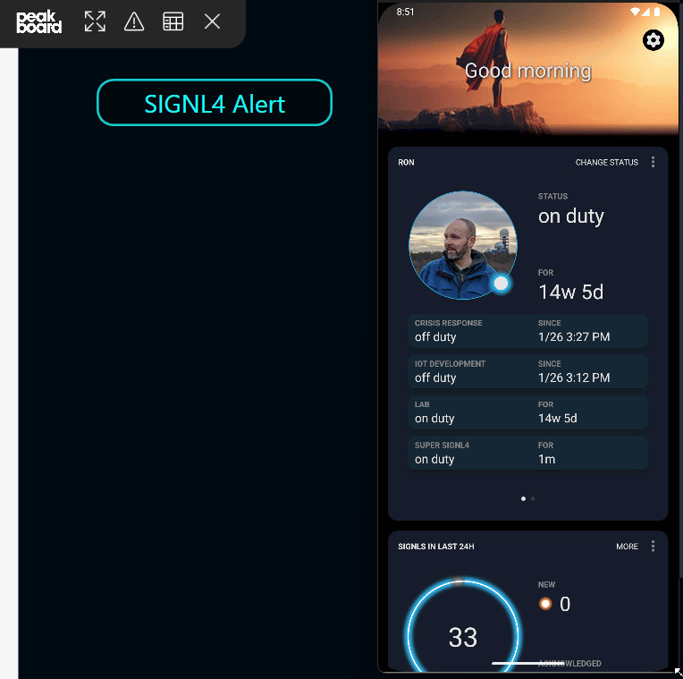
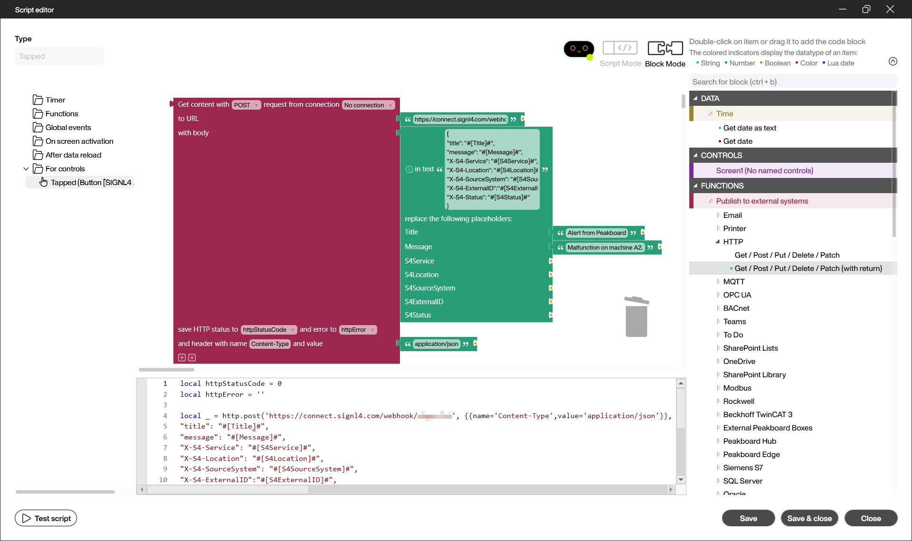
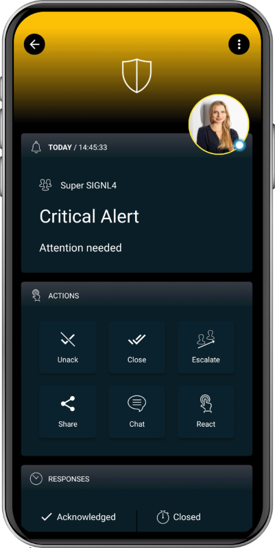

# SIGNL4 Integration with Peakboard

[Peakboard](https://www.peakboard.com/en-us) is a low-code industrial software platform that helps production and logistics teams quickly digitize, visualize, and interact with real-time data from machines and systems (like SAP, PLCs, Excel). It lets you build custom dashboards and industrial apps without programming to monitor and optimize processes on any device.

SIGNL4 enhances Peakboard with reliable mobile alerting, including a mobile app, push notifications, SMS messages, voice calls, automated escalations, and on-call scheduling. SIGNL4 ensures that critical alerts reach the right people reliably – anytime, anywhere.

This can help service technicians or production managers receive actionable alerts when they are away from the dashboard.



## Prerequisites

- A SIGNL4 (https://www.signl4.com) account
- A Peakboard (https://www.peakboard.com/en-us) local device or Peakboard Hub

## How to Integrate

Integrating SIGNL4 with Peakboard is straightforward. Here’s how it works.

In this example, we use Peakboard Designer to add a button and create a script that runs when the button is clicked.

In the Peakboard Designer you just add a button and double-click it. The Script Editor opens where you can add a HTTP -> Get / Post / Delete / Patch (with return). Set the URL to your SIGNL4 webhook URL including team or integration secret.

Here’s how it looks in the Script Editor.



The respective script looks like this:

```javascript
local httpStatusCode = 0
local httpError = ''

local _ = http.post('https://connect.signl4.com/webhook/{team-secret}', {{name='Content-Type',value='application/json'}}, string.gsubph([[{
"title": "#[Title]#",
"message": "#[Message]#",
"X-S4-Service": "#[S4Service]#",
"X-S4-Location": "#[S4Location]#",
"X-S4-SourceSystem": "#[S4SourceSystem]#",
"X-S4-ExternalID":"#[S4ExternalID]#",
"X-S4-Status": "#[S4Status]#"
}]], { Title = 'Alert from Peakboard', Message = 'Malfunction on machine A2.', S4Service = '', S4Location = '', S4SourceSystem = '', S4ExternalID = '', S4Status = '' }) --[[ For more information about the parameters go to: https://docs.signl4.com/integrations/webhook/webhook.html --]], function(r) httpStatusCode = r.status httpError = r.error end).content
```

You need to replace {team-secret} by your SIGNL4 team or integration secret. Find more information about the SIGNL4 webhook integration and payload parameters [here](For more information about the parameters go to: https://docs.signl4.com/integrations/webhook/webhook.html). 

Now you can test the integration in Preview mode. Click the button and you should receive the alert in your SIGNL4 mobile app. That's it.

The alert in SIGNL4 might look like this.



