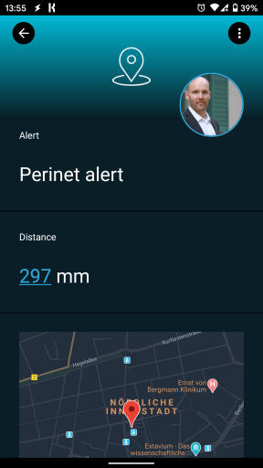

# SIGNL4 Integration with Perinet

[Perinet](https://www.perinet.io/) focuses on the seamless connection of sensors and actuators with IT-systems. It easily and securely bridges the gap between production and IT and enables intelligent sensor-to-cloud solutions for IoT, IIoT & Industry 4.0 use cases. Pairing these powerful devices with SIGNL4 can enhance your daily operations with an extension to your team on the shop floor or in the field.

In our example we integrate SIGNL4 using [Node-RED](https://nodered.org/) running on [HARTING MICA](https://www.harting-mica.com/en).

We have connected a distance sensor to the periNODE smart adapter that is sending distance information to the HARTING MICA via MQTT.

There, Node-RED is running. The respective flow processes the information coming from the periNODE. We use the [SIGNL4 node](https://flows.nodered.org/node/node-red-contrib-signl4) in Node-RED to send the alert data to your SIGNL4 team. All you need to configure in your SIGNL4 node is your SIGNL4 team secret.

SIGNL4 is a mobile alert notification app for powerful alerting, alert management and mobile assignment of work items. Get the app at [https://www.signl4.com](https://www.signl4.com/).

You can find a sample Node-RED flow in [GitHub](https://github.com/signl4/signl4-integrations-perinet).

The alert in SIGNL4 might look like this.

