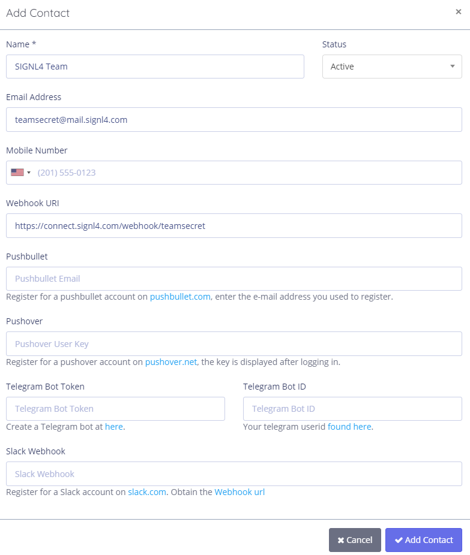

# SIGNL4 Integration with Pingniner

[Pingniner](https://pingniner.com/) is an agent less monitoring site that checks server and application availability. Pingniner monitors your website uptime, domain name expiry, performs SSL certificate checks and monitors cron jobs all in one web interface.  SIGNL4 alerts your server team when a machine is unreachable or your application team when one or more of your websites is experiencing an outage.  Pingniner will generate the emails but SIGNL4 puts those alerts into the hands of the technicians, no matter where they are.

In our example we are using Pingniner to monitor the up time of critical servers and applications.  We will use the SIGNL4 webhook to receive incident data and generate alerts.

SIGNL4 is a mobile alert notification app for powerful alerting, alert management and mobile assignment of work items.  Get the app at [https://www.signl4.com](https://www.signl4.com/)

## Prerequisites

- A SIGNL4 ([https://www.signl4.com](https://www.signl4.com/)) account
- A Pingniner  ([https://pingniner.com](https://pingniner.com/)) account

## How to Integrate

[Pingniner](https://pingniner.com/) is an agent less monitoring site that checks server and application availability. Pingniner monitors your website uptime, domain name expiry, performs SSL certificate checks and monitors cron jobs all in one web interface.  SIGNL4 alerts your server team when a machine is unreachable or your application team when one or more of your websites is experiencing an outage.  Pingniner will generate the emails but SIGNL4 puts those alerts into the hands of the technicians, no matter where they are.

First, lets create a contact for your SIGNL4 team. In the left navigation menu select Alerting > Contacts.

Click Add Contact on the top right-hand side.

Pingniner can use the SIGNL4 team email address and/or the team specific Webhook URL. You will only want to use 1 of these for the account because if you use both in the same contact, you will generate duplicates alerts to be sent.

Now lets generate a monitor. We will be monitoring the status of a critical server in our environment.

1. Click on Servers -> Add Server.  
2. Give it a name and select the operating system.  
3. From there you will be able to download an agent to install on your server.

Once the agent is installed we start receiving metrics within a few minutes.

To generate an alert, we simply need to turn the machine off. We have alert rules in place by default that will alert the SIGNL4 team of ‘No Data’

Alert will be received via the SIGNL4 mobile app.

