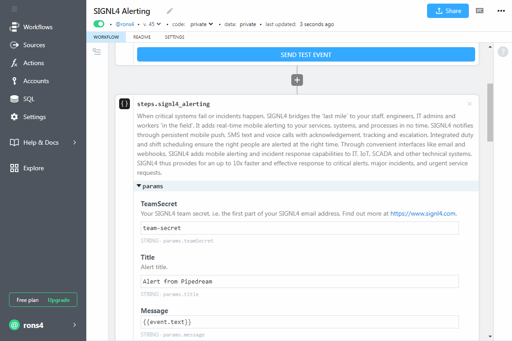
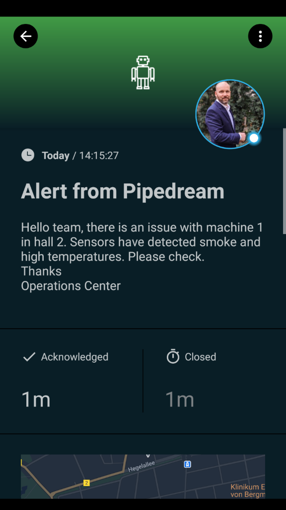

# SIGNL4 Integration with Pipedream

[Pipedream](https://pipedream.com/) is a serverless integration and compute platform that makes it easy to connect apps and develop event-driven workflows.

Pairing Pipedream with SIGNL4 can enhance your daily operations with an extension to your team wherever it is. The integration does not only allow you to know when a critical issue has occurred but also when it was resolved no matter where you are.

The integration of Pipedream and SIGNL4 is done using a webhook and available as a ready-to-use Action. This one generates an alert and sends it to a SIGNL4-Team.

## Prerequisites

- A SIGNL4 account ([https://www.signl4.com](https://www.signl4.com/))
- A Pipedream account ([https://pipedream.com](https://pipedream.com/))

## How to Integrate

Login to the Pipedream portal and create a new Workflow. In our example the trigger is an email.

[

Now you add a Step and in the search box you enter SIGNL4. Add the SIGNL4 Alerting Action and specify the parameters accordingly. You can use static parameters or values from previous steps. The TeamSecret is your SIGNL4 team secret, i.e. the first part of your SIGNL4 email address.

That is it and now you can test the alert. You can do so directly in your workflow and you should then receive an alert in your SIGNL4 app.

The alert in SIGNL4 might look like this.

