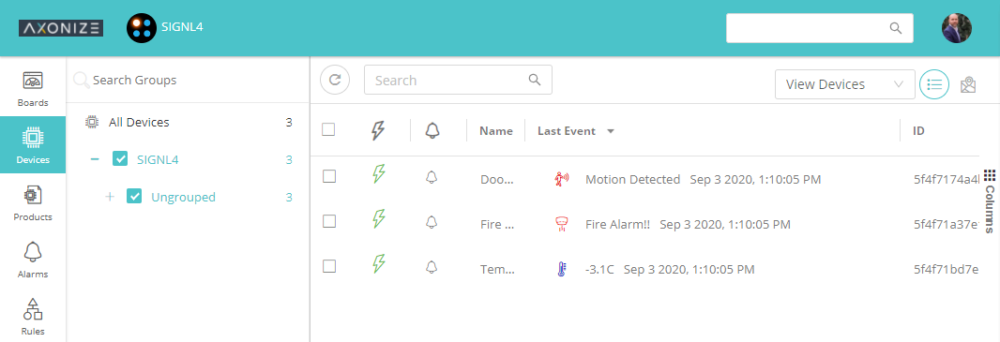
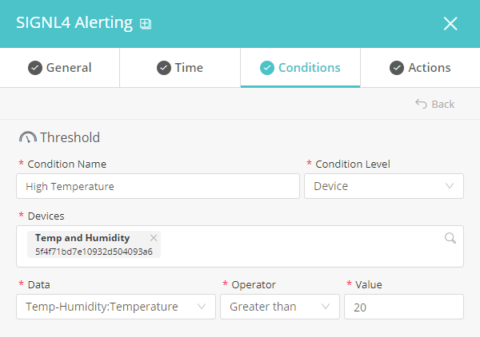
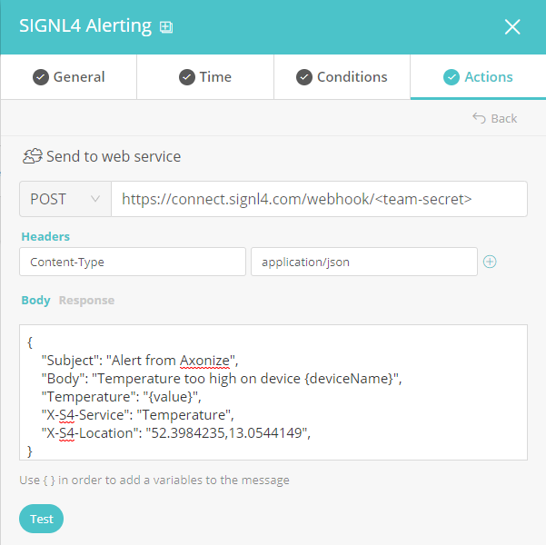

# SIGNL4 Integration with Planon (Axonize)

[Axonize](https://www.axonize.com/) has fully transitioned into Planon’s open platform for real estate and facility management professionals and is also referred to as Planon’s IoT-enabled building management software. It is a no-code, smart enterprise IoT platform for connecting, monitoring and analyzing an unlimited number of devices, sensors and protocols. It offers full-dashboard functionality, customizable rules, predictive maintenance, alerts and charts to monitor and analyze data from multiple devices and applications, all within a single portal.

In our example we use an already existing temperature sensor to generate our data. We focus on the rules part to send out alerts to a SIGNL4 team when the temperature is too high.

SIGNL4 is a mobile alert notification app for powerful alerting, alert management and mobile assignment of work items. Get the app at [https://www.signl4.com](https://www.signl4.com/).

## Prerequisites

- A SIGNL4 account ([https://www.signl4.com](https://www.signl4.com/))
- A Axonize account ([https://planonsoftware.com/uk/software/planon-platform/axonize-is-now-a-planon-company/](https://planonsoftware.com/uk/software/planon-platform/axonize-is-now-a-planon-company/))

In the Axonize portal under Devices we have already created some devices. We focus on the temperature / humidity sensor here.



Now you can create a new rule under Rules. Under General you can give a name and a description for the new rule and unter Time you can just leave the default settings.



Under Conditions we specify our condition for this rule. In our case we say that the temperature of our sensor device must be greater then 20 degrees in order to trigger this rule.



Under Actions we add the new action "Send to web service". Here we specify the following parameters.


**POST**: The SIGNL4 webhook URL including your team secret.

**Headers**: Content-Type: application/json

**Body**: The JSON representation of your alert data. You can also specify dynamic data here, for example _{deviceName}_ or _{value}_.

In our example we use the following JSON data.

```json
{  
    "Subject": "Alert from Axonize",
    "Body": "Temperature too high on device {deviceName}",
    "Temperature": "{value}",
    "X-S4-Service": "Temperature",
    "X-S4-Location": "52.3984235,13.0544149",
}
```

This is it. You can now test your IoT scenario by simulating an appropriate event. You will then receive an alert in your SIGNL4 app.

The alert in SIGNL4 might look like this.


