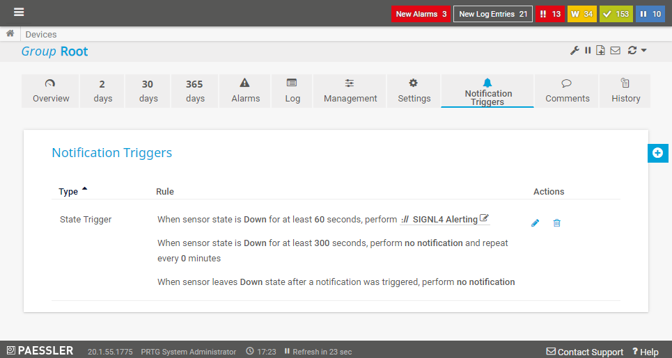
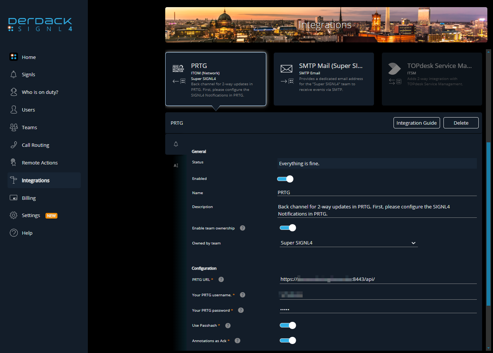
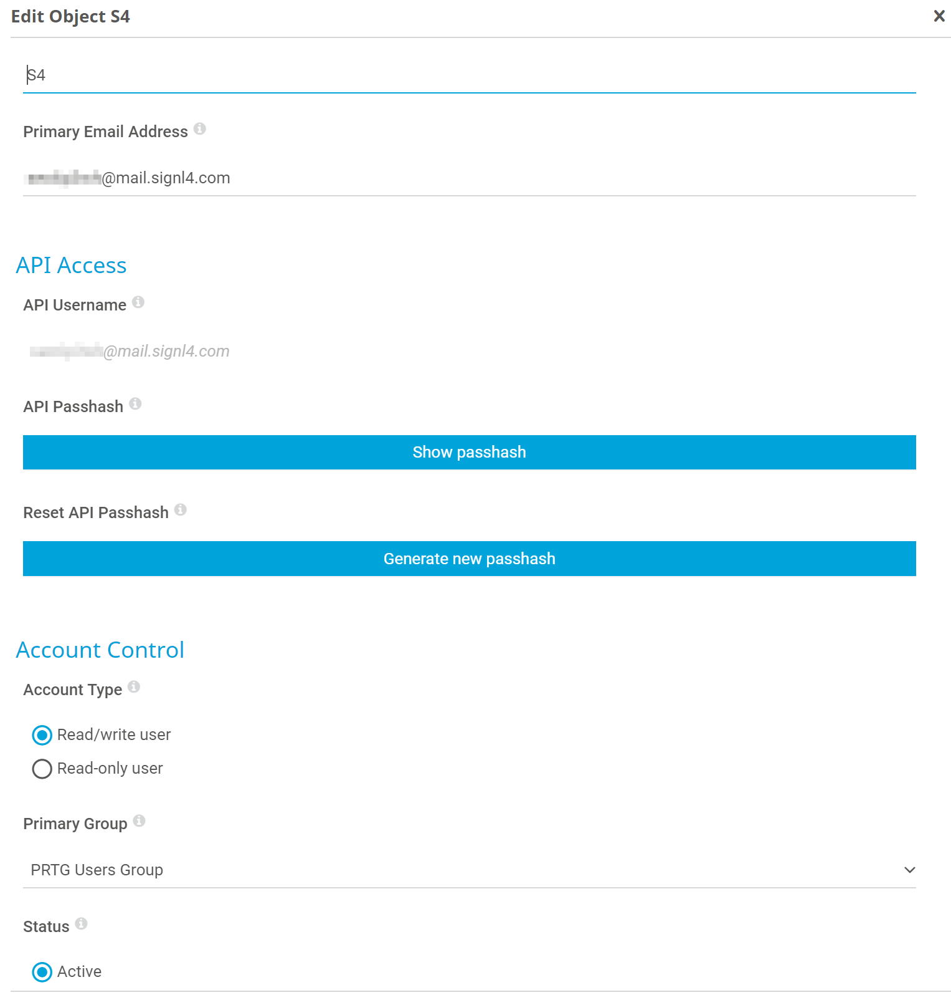
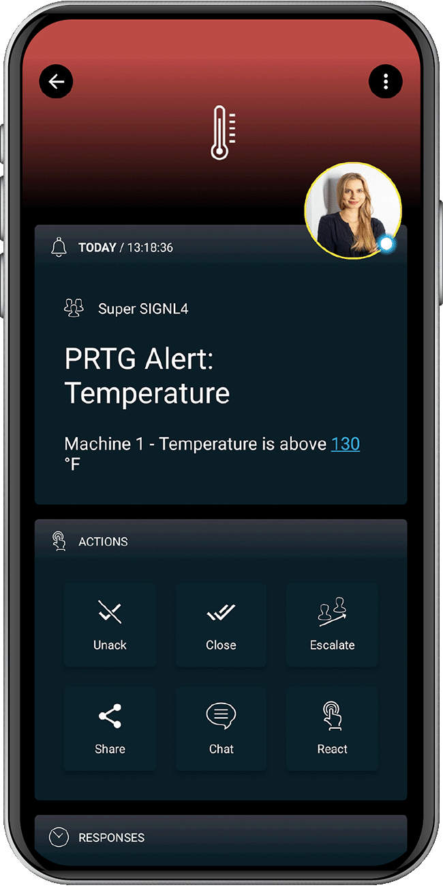

# SIGNL4 Integration with PRTG

PRTG Network Monitor is an agentless network monitoring software from Paessler AG. It can monitor and classify system conditions like bandwidth usage or uptime and collect statistics from miscellaneous hosts as switches, routers, servers and other devices and applications. A major issue about the mobile app is you cannot see who is on call or members from your team.  If an alert comes in and you need to collaborate with a team member, there is no way of knowing who is currently on call. SIGNL4 displays active team members directly on the app so you know who to contact if a critical alert comes in and you are not the subject matter expert.


You can configure the PRTG integration with SIGNL4 as follows.

Here, we describe two ways to integrate SIGNL4 with PRTG, via HTTP request and via email.


## HTTP Request

First you need to create a new Notification Template at Setup -> Account Settings -> Notification Templates. Here you choose Execute HTTP Action where you can specify your SIGNL4 webhook URL including the team secret, select the HTTP Method Post and enter the Payload including placeholders.

The payload might look like this: ```Title=Alert from PRTG&Site=%sitename&Message=%device %name %status %down (%message)```

Here you can find a description about the supported placeholders: https://kb.paessler.com/en/topic/373-what-placeholders-can-i-use-with-prtg

So you have a format like this: ```Parameter1=Value1&Parameter2=Value2```, etc.



Resolve Alerts: In order to support the resolution of alerts in SIGNL4 you can just add the following part to your SIGNL4 webhook URL:

```
?ExtIDParam=sensorid&ExtStatusParam=laststatus&ResolvedStatus=Up
```

So, the complete URL looks like this:

https://connect.signl4.com/webhook/team-secret?ExtIDParam=sensorid&ExtStatusParam=laststatus&ResolvedStatus=Up
Where “team-secret” is your SIGNL4 team secret. You then need to add the parameters “sensorid” and “laststatus” to the Payload:

```
Title=%device: %name&Message=%message&sensorid=PRTG: %sensorid&laststatus=%laststatus&X-S4-SourceSystem=PRTG
```
Attention: In order to support alert resolution, you need to make sure you configure the Notification Triggers in PRTG to send notifications to SIGNL4 also for Up states (not only for Down states).

You can find more information about the resolution of alerts in SIGNL4 here: https://www.signl4.com/blog/update-july-2020-resolve-alerts/. You can easily test the SIGNL4 notification template from here.

Then, at Sensors -> [Choose your sensor] -> Notification Triggers or at Devices -> Notification Triggers, you can specify your notification trigger including the conditions and the SIGNL4 notification template.

### Alternative

You can also create separate HTTP actions for alerting and resolution (closing of an alert). This makes sense if you have multiple resolution statuses. In this case your data look like follows.

URL:

```
https://connect.signl4.com/webhook/team-secret
```
Replace team-secret with your team or integration secret.

Payload for the alert (Status Down):

```
Title=%device: %name&Message=%message&X-S4-ExternalID=PRTG: %sensorid&X-S4-Status=new&X-S4-SourceSystem=PRTG
```

Payload for the resolution (Status Up, Closing of the alert):

```
Title=%device: %name&Message=%message&X-S4-ExternalID=PRTG: %sensorid&X-S4-Status=resolved
```

### Two-way integration

For two-way communication there is a PRTG connector app available in SIGNL4 under Integrations -> Gallery -> PRTG. This connector app adds two-way functionality to SIGNL4 alerting in PRTG. It allows you to acknowledge (or close or annotate) problems in PRTG directly from within your SIGNL4 app.



In order to use the Connector you need to make sure you have SIGNL4 alerting activated in PRTG. The configuration of the PRTG connector app is straightforward. You just need the PRTG username, password and the URL to your PRTG server. Please note that the URL needs to be reachable from the internet (e.g. port 443). The user account needs to have the according access rights for the PRTG API.

## Video Tutorial

This video shows how it works.

<iframe width="560" height="315" src="https://www.youtube-nocookie.com/embed/PnzMAzODqPU?si=fN5yf2Fsk6nZgzu1" title="YouTube video player" frameborder="0" allow="accelerometer; autoplay; clipboard-write; encrypted-media; gyroscope; picture-in-picture; web-share" referrerpolicy="strict-origin-when-cross-origin" allowfullscreen></iframe>

## Email



Create a user within PRTG with the name of SIGNL4 and your team email address. Assign that user to a group that is monitoring existing sensors.

Note: In the screenshot below the user name is SIGNL4, email address is your team email and the user is part of the PRTG Users Group.

At this point the next time something triggers an alarm, your SIGNL4 team will be notified via the mobile app.

You can find more information about PRTG [here](https://kb.paessler.com/en/topic/89558-how-can-i-integrate-derdack-signl4-into-prtg).

This is it and an incoming alert will look like this.


