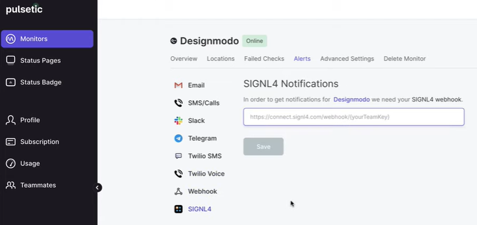

# SIGNL4 Integration with pulsetic

With [pulsetic](https://pulsetic.com/), you can easily get alerts when your website is down. Besides this you can create beautiful status pages and incident management reports to keep your visitors updated.

SIGNL4 extends pulsetic and adds app-based mobile alerting and incident response including push, SMS text, voice calls, escalations and collaboration. The integrated duty planning helps you to schedule your team’s on-call duties and allows you to see how is on duty at any given time.

In the pulsetic web portal you can configure your SIGNL4 alerting.



In order to configure SIGNL4 alerting go to Alerts -> SIGNL4 in the pulsetic web portal. Here you can enter your SIGNL4 webhook address including team secret.

```
https://connect.signl4.com/webhook/{team-secret}
```

Here, {team-secret} is your SIGNL4 team secret.

That’s it. Now your SIGNL4 team gets notified when pulsetic has detected a problem.

The alert in SIGNL4 might look like this.


