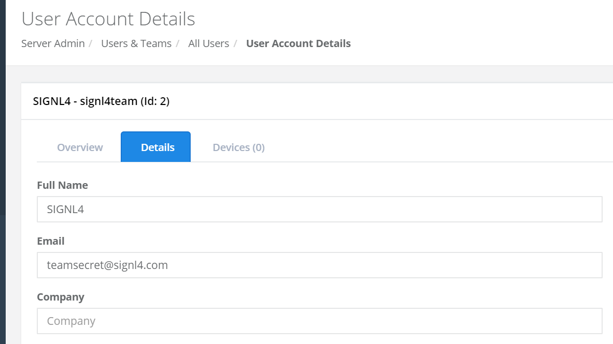
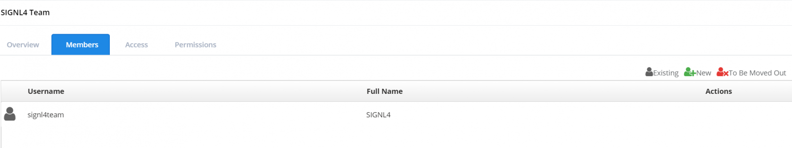

# SIGNL4 Integration with Pulseway

Using [Pulseway](https://www.pulseway.com/) alone is a great step to making sure you can tackle any system issues from anywhere in the world. But making sure you know about these issues before they become critical is the first step. That’s where SIGNL4 comes in.  Intercepting notification messages and alerting team members of server status is a great proactive approach to ensure the networks stays up and running.

Create a User from the web portal with the SIGNL4 email address.

Assign that user to a to a Team responsible for monitoring devices.

On Duty SIGNL4 members will now receive alerts based on the notifications sent from Pulseway.

The alert in SIGNL4 might look like this.

