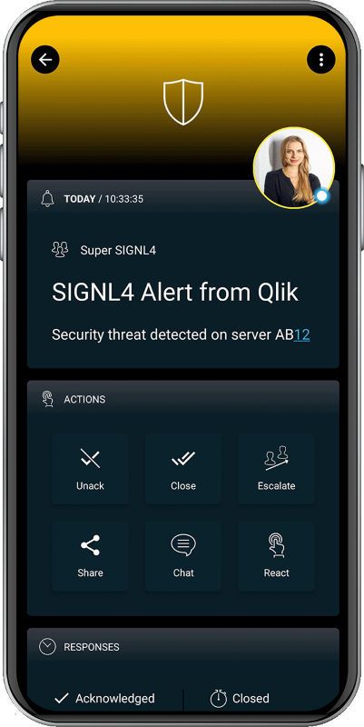

# SIGNL4 Integration with Qlik Application Automation

[Qlik](https://www.qlik.com/us) (formerly Blendr.io) is a SaaS integration platform that offers a complete integration toolkit to empower your customers, success management team and developers. With rapid and secure native integrations Qlik helps developers with time-consuming integration and maintenance tasks. Pairing this powerful platform with SIGNL4 can enhance your daily operations with an extension to your team wherever it is.

SIGNL4 is a mobile alert notification app for powerful alerting, alert management and mobile assignment of work items. Get the app at [https://www.signl4.com](https://www.signl4.com/).

In the picture below we send ticket information from Qlik to SIGNL4.

## Prerequisites

- A SIGNL4 ([https://www.signl4.com](https://www.signl4.com/)) account
- A Qlik ([https://www.qlik.com/us/](https://www.qlik.com/us/)) account

## How to Integrate

In your Qlik you can just insert the native SIGNL4 Integration whenever you wish to send notifications to your SIGNL4 team. You just need to configure your SIGNL4 team-secret. Start the Qlik and when the SIGNL4 integration is executed, an alarm will be sent to your SIGNL4 team. You can find a sample in GitHub: [https://github.com/signl4/signl4-integration-blendr-io](https://github.com/signl4/signl4-integration-blendr-io)

The alert in SIGNL4 might look like this.

