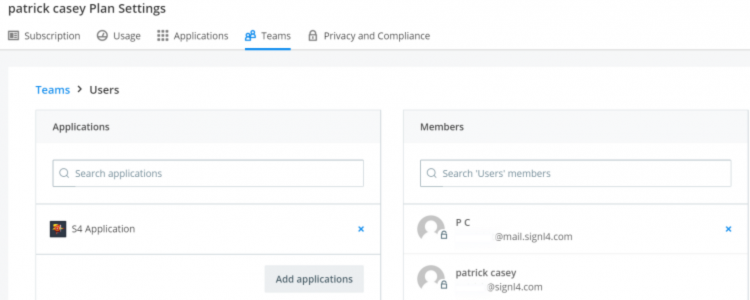
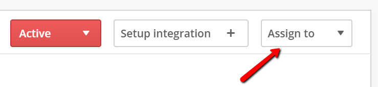
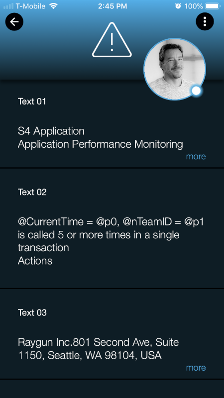

# SIGNL4 Integration with Raygun

[Retrace](https://stackify.com/retrace/) helps developers monitor the performance of their applications.  It also provides server data and critical warnings.  These notifications are sent via Email or SMS.  SIGNL4 takes those notifications to the next level.  Not only will users be notified but with on call scheduling, these alerts will go to the right people at the right time.  Alerts will not be missed in an email inbox thanks to SIGNL4’s multiple notification channels and persistent alerting.  With escalation procedures built in, SIGNL4 will ensure that time critical alerts are responded to quickly.

In our example we are using Raygun to monitor the number of database calls within an application.  We are forwarding SMTP notifications to the SIGNL4 team email address to receive the alerts.

SIGNL4 is a mobile alert notification app for powerful alerting, alert management and mobile assignment of work items.  Get the app at [https://www.signl4.com](https://www.signl4.com/)

## Prerequisites

- A SIGNL4 ([https://www.signl4.com](https://www.signl4.com/)) account
- A Raygun ([http://www.raygun.com](http://www.raygun.com/)) account

## How to Integrate

First let’s create the SIGNL4 user. From the top left navigation menu on the left side click on Invite Team.  The invite will come to the SIGNL4 mobile app where you can validate the email.

Then make sure the user is assigned to the associated Application within Raygun. Under Manage Teams make sure the application and the users are listed.

Now lets assign an incident to the user that we just created. Within the application click on Issues and select an issue to assign. On the Top right hand side click on the drop down box for Assign to and select the SIGNL4 user.

This will then immediately send an email alert to the SIGNL4 team.

