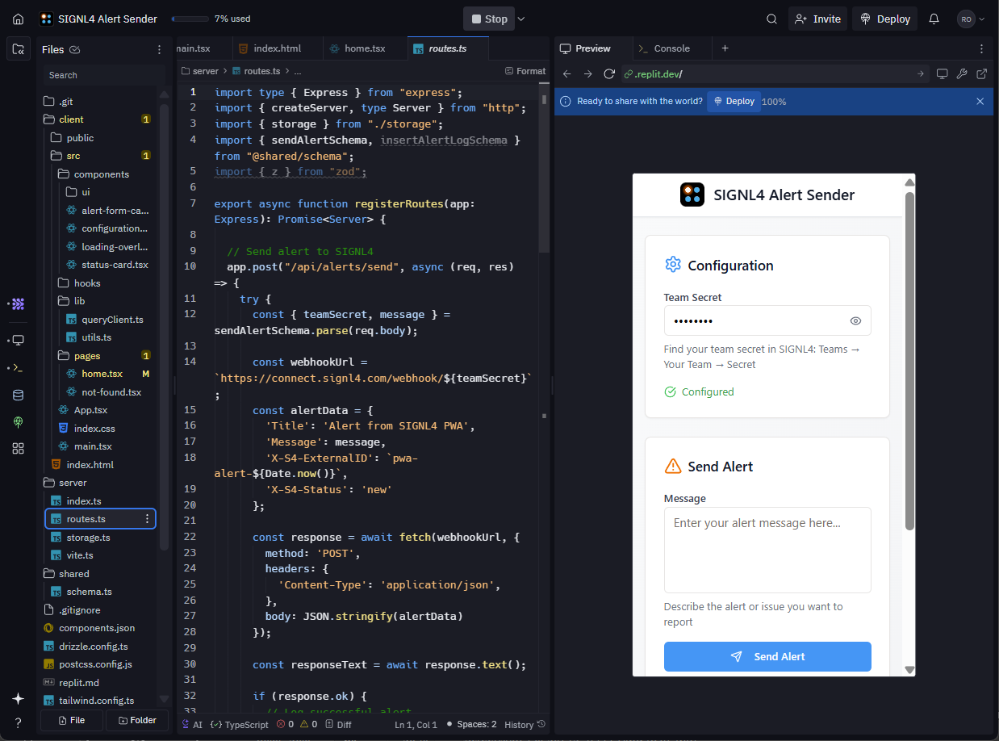
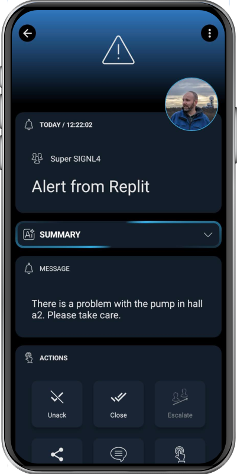

# SIGNL4 Integration with Replit

[Replit](https://replit.com/) is an online integrated development environment (IDE) that allows users to write, run, and share code directly in the browser. It supports a wide range of programming languages and is commonly used for learning, prototyping, and collaborating on software projects.

With features like multiplayer mode and a vibrant community, Replit encourages "vibe coding" – a relaxed, creative, collaborative and often AI-supported approach to programming.

Integrating SIGNL4 into your projects for reliable mobile alerting is straightforward, hassle-free and it can easily be achieved using vibe coding.

SIGNL4 adds reliable mobile alerting to Replit with features like mobile app, push notifications, SMS messaging, voice calls, automated escalations, and on-call duty scheduling. SIGNL4 ensures that critical alerts reliably reach the responsible personnel – anytime, anywhere.



## Prerequisites

A SIGNL4 (https://www.signl4.com) account
An replit (https://replit.com) account

## How to Integrate

You can integrate SIGNL4 in your Replit projects using the [SIGNL4 webhook API](https://docs.signl4.com/integrations/webhook/webhook.html). You can find various code samples [here](https://docs.signl4.com/samples/code-samples/code-samples.html).

Alternatively, you can integrate SIGNL4 using a vibe coding approach by leveraging Replit’s AI Agent – simply provide a prompt describing what you want to achieve, and let the agent help you build it.

Here is a sample prompt:

```
Please create a simple web app (PWA) for desktop or mobile that sends SIGNL4 alerts using the SIGNL4 webhook API.
- Allow the user to configure the SIGNL4 team secret
- Have only one text field "Message" and one button "Send Alert"
- App icon should be this https://raw.githubusercontent.com/signl4/signl4-logo/refs/heads/main/signl4.svg
```

After some work Replit created this app:
[https://replit.com/@roncz/SIGNL4-Alert-Sender?v=1#replit.md](https://replit.com/@roncz/SIGNL4-Alert-Sender?v=1#replit.md)

You just need to enter your SIGNL4 team or integration secret, an alert message and send the alert.

The alert in SIGNL4 might look like this.


