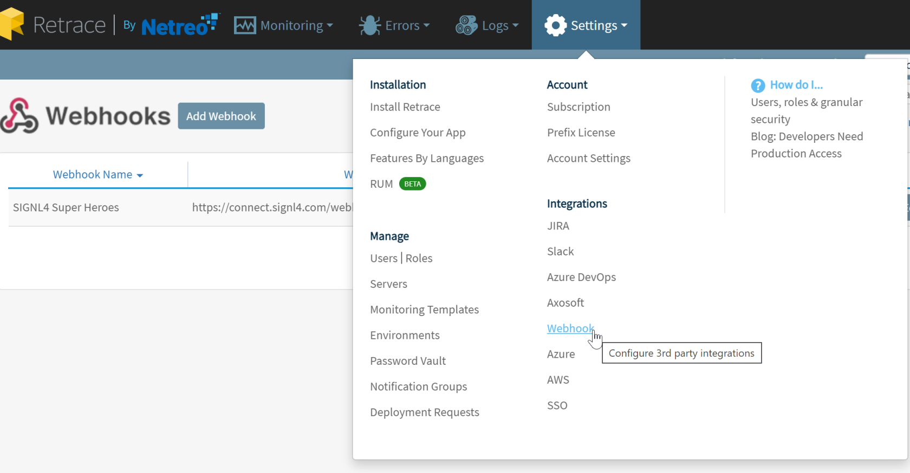
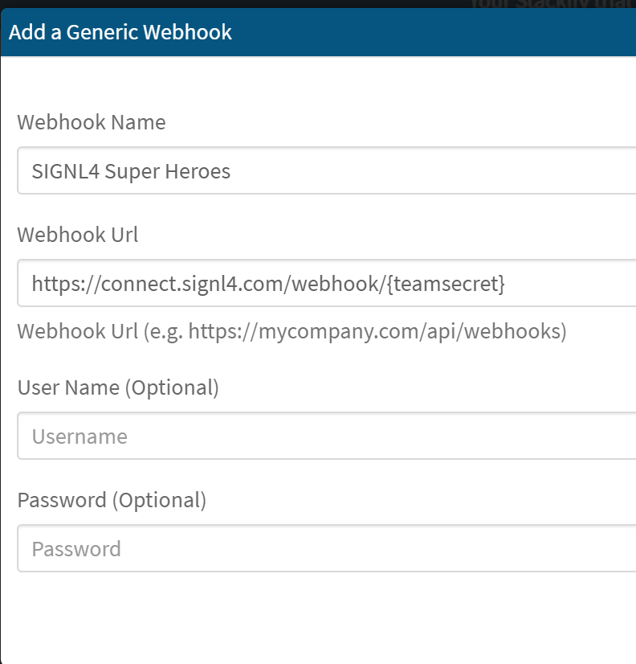
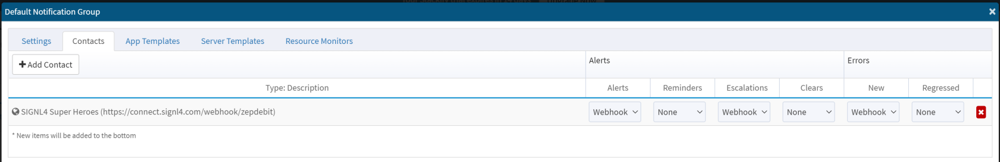
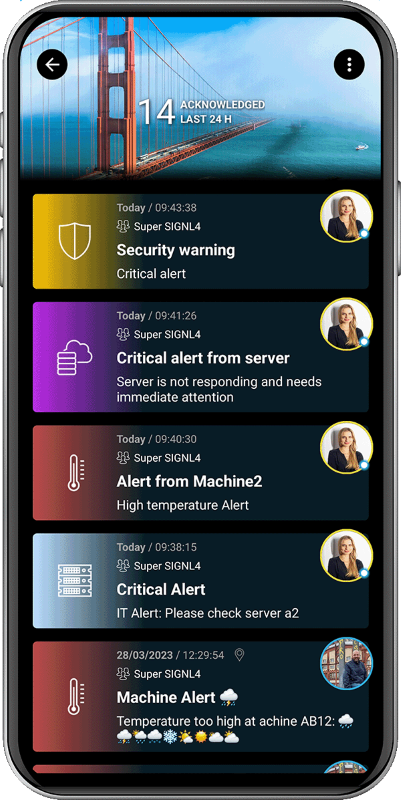

# SIGNL4 Integration with Retrace by Stackify

[Retrace](https://stackify.com/retrace/) helps developers monitor the performance of their applications.  It also provides server data and critical warnings.  These notifications are sent via Email or SMS.  SIGNL4 takes those notifications to the next level.  Not only will users be notified but with on call scheduling, these alerts will go to the right people at the right time.  Alerts will not be missed in an email inbox thanks to SIGNL4’s multiple notification channels and persistent alerting.  With escalation procedures built in, SIGNL4 will ensure that time critical alerts are responded to quickly.

First thing that needs to be done is to create a webhook integration to send alert and errors to.

From the top navigation click on the Settings drop down menu and select Webhook under the Integrations heading.

Click Add Webhook.

Enter the Name and SIGNL4 webhook URL and click Save.

Edit the Notification Group that is currently notifying on Alerts and Errors.  Ensure that the new SIGNL4 webhook is selected and choose which Alert and Error type you would like sent to SIGNL4.

SIGNL4 will now receive alerts and errors that arise.

