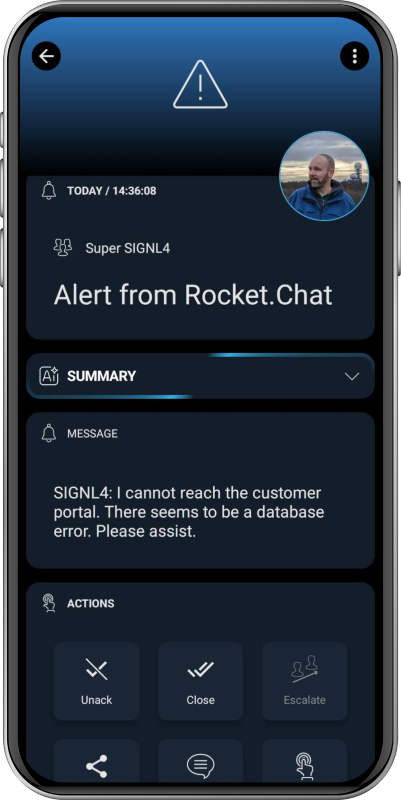

# SIGNL4 Integration with Rocket.Chat

[Rocket.Chat](https://www.rocket.chat/) is an open-source team communication platform that enables secure messaging, video calls, and collaboration across teams and organizations. Integrating Rocket.Chat with SIGNL4 ensures that critical alerts are instantly delivered to the right on-call personnel, enabling faster response times and improved incident management.

SIGNL4 is a mobile alerting and incident management platform supporting app push, SMS text and voce calls with built-in escalations, on-call scheduling, and collaboration. Get the app at [https://www.signl4.com](https://www.signl4.com/).

## Prerequisites
- A [SIGNL4](https://www.signl4.com/) account
- A RocketChat](https://www.rocket.chat/) instance

## How it works

Rocket.Chat provides a nice way to integrate SIGNL4. In the following we will show you how a chat message containing a certain keyword will trigger a SIGNL4 alert.

On the other side we will also show how to send an SIGNL4 annotation back to your Rocket.Chat chat.

### Rocket.Chat to SIGNL4 Alert

In order to trigger a SIGNL4 alert from your Rocket.Chat chat you need to create a new integration in your Rocket.Chat Administration portal under Integrations -> Outgoing WebHook Integration.

Here you specify the following:  
**Event Trigger**: Message Sent  
**Name**: SIGNL4 Alerting or any name you like  
**Channel**: Your Rocket.Chat channel, e.g. #general  
**Trigger Word**: E.g. SIGNL4, in this case ans chat message containing "SIGNL4" will trigger the alert  
**URL**: Your SIGNL4 webhook URL including team or integration secret, e.g. https://connect.signl4.com/webhook/{team-secret}  
**Post as**: Your SIGNL4 user name, e.g. SIGNL4  
**Avatar URL**: Link to SIGNL4 logo, e.g. https://raw.githubusercontent.com/signl4/signl4-logo/refs/heads/main/signl4.png  
**Enable Script**: Enable  
**Script**: See below.  
The rest can remain as is.

You can use the following script to adapt the parameters so they look nicer in SIGNL4.

```javascript
class Script {
    prepare_outgoing_request({ request }) {
        request.data.title = 'Alert from Rocket.Chat';
        request.data.message = request.data.text
        request.data.user = request.data.user_name;
        request.data['X-S4-ExternalID'] = 'RocketChat';
        request.data['X-S4-SourceSystem'] = 'RocketChat';
        return request;
    }
}
```

That's it. Now, when you send a chat message containing the keyword SIGNL4, and alert is triggered. The alert in SIGNL4 might look like this.



### SIGNL4 Annotation to Rocket.Chat

Besides sending chat messages to SIGNL4 it is also possible to send status updates like acknowledgement, close or annotations back from SIGNL4 to Rocket.Chat.

In order to configure this, you need to go to your Rocket.Chat Administration portal and then to Integrations -> Incoming WebHook Integration. Here you create a new integration with the following parameters.


**Name**: SIGNL4 Alerting or any name you like  
**Post to Channel**: Your Rocket.Chat channel to post to, e.g. #general  
**Post as**: Your SIGNL4 user name, e.g. SIGNL4  
**Avatar URL**: Link to SIGNL4 logo, e.g. https://raw.githubusercontent.com/signl4/signl4-logo/refs/heads/main/signl4.png  
**Enable Script**: Enable  
**Script**: See below.  
The rest can remain as is.

You can use the following script to adapt the parameters so they look nicer in SIGNL4.

```javascript
class Script {
  process_incoming_request({ request }) {

    let message = '';

    if (request.content.eventType == 201 && request.content.alert.statusCode == 2) {
      message = request.content.user.username + ': Alert acknowledged.';
    }
    else if (request.content.eventType == 201 && request.content.alert.statusCode == 4) {
      message = request.content.user.username + ': Alert closed.';
    }
    else if (request.content.eventType == 203) {
      message = request.content.user.username + ': ' + request.content.annotation.message;
    }

    if (message != '') {
      return {
        content:{
          text: message
        }
      };
    }
  }
}
```

In SIGNL4 you need to configure the [outbound webhook](https://www.signl4.com/outbound-webhooks/) in SIGNL4. The URL here is your Webhook URL from the Incoming WebHook Integration above, e.g. http://your-rocketchatserver:3000/hooks/67dd7f1e3a0de1f183af6a9c/gpYRM3guKfpDKacaf6r2XiXZy2Q6oYPJ9iEGmWtWMMtc3mDt.

Please note that this URL needs to be available from the internet.
