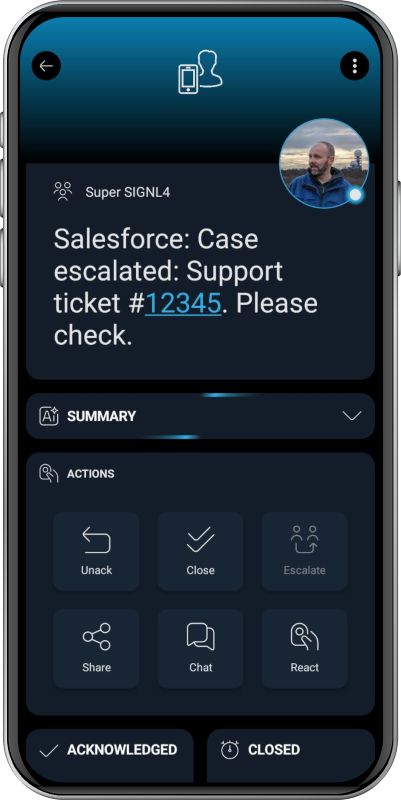

# SIGNL4 Integration with Salesforce

[Salesforce](https://www.salesforce.com/) is a cloud-based CRM platform that helps businesses manage sales, service, marketing, and customer relationships. It centralizes customer data, automates processes, and supports custom apps and integrations to improve productivity and growth.

SIGNL4 enhances Salesforce with reliable mobile alerting, including a mobile app, push notifications, SMS, voice calls, automated escalations, and on-call scheduling. It ensures critical Salesforce alerts reach the right people anytime, anywhere.

It can be used to instantly notify on-call teams about critical service tickets, urgent incidents, or important customer updates in Salesforce, ensuring fast response and resolution.

## Prerequisites
A SIGNL4 (https://www.signl4.com) account
A Salesforce (https://www.salesforce.com/) account

## How to Integrate

Integrating SIGNL4 with Salesforce is straightforward.

SIGNL4 is directly available as a dedicated connector in Salesforce Flow, allowing you to connect your Salesforce org to your SIGNL4 account with API key-based authentication. Within Salesforce Flow Builder or the Integrations tab, you create a connection by entering your SIGNL4 API key and instance URL, which can then be reused across flows.

Once connected, you can use the provided SIGNL4 actions – such as triggering alerts, retrieving alert details or timelines, and listing users – to automate alerting workflows based on Salesforce events. This lets you seamlessly incorporate SIGNL4 alerting into your Salesforce automation with clicks, no code, leveraging Flow Builder to trigger and manage SIGNL4 alerts as part of your business processes.

You can find a more detailed description of how to configure SIGNL4 mobile alerting in Salesforce [here](https://help.salesforce.com/s/articleView?id=platform.automate_flow_ref_third_party_derdack_signl4.htm&type=5).

That's it.

The alert in SIGNL4 might look like this.

