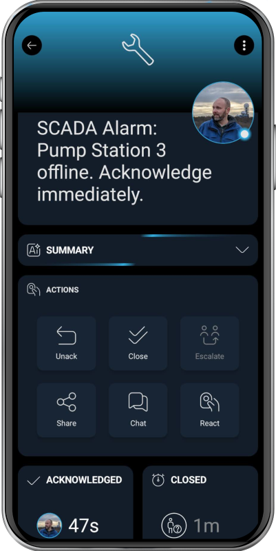

# SIGNL4 Integration with SCADA Systems

[SCADA (Supervisory Control and Data Acquisition)](https://en.wikipedia.org/wiki/SCADA) systems are used to monitor and control industrial processes in real time. They collect data from PLCs, sensors, and remote devices to supervise equipment, automate operations, and detect failures across industries such as manufacturing, utilities, energy, water treatment, and critical infrastructure.

SIGNL4 reliably delivers critical SCADA alarms and operational alerts to the right engineers, operators, and maintenance teams at the right time – anywhere. It notifies on-call staff via persistent mobile push, SMS text, and voice calls with acknowledgment, tracking, and escalation.

SIGNL4 provides flexible integration options for SCADA, HMI, and industrial automation systems – either directly through APIs, SMTP, or webhooks, an own edge proxy, or via third-party platforms and gateways such as [Node-RED](https://docs.signl4.com/integrations/node-red/node-red.html), OPC UA bridges, IoT platforms, and monitoring tools.

SCADA environments commonly use protocols and interfaces such as OPC UA, MQTT, Modbus TCP, DNP3, IEC 60870-5-104, EtherNet/IP, Profinet, Profibus, SNMP, REST APIs, SOAP, and XML.

Please contact us at hello [@] signl4.com and we will be happy to help you find the best way to integrate with your systems.

The alert in SIGNL4 might look like this.

