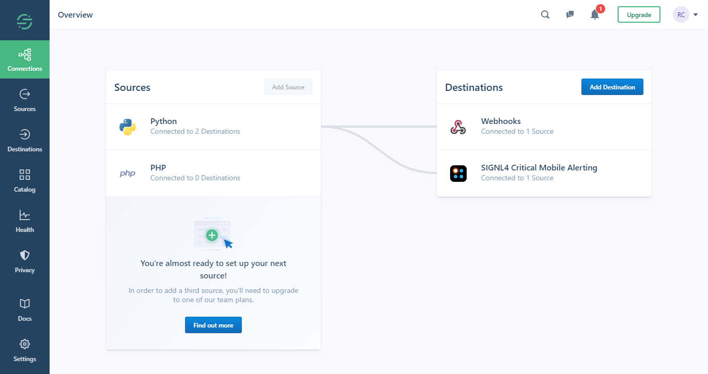

# SIGNL4 Integration with Segment

The integration of Segment and SIGNL4 is done either using a Webhook destination or using a dedicated destination function. In our example we send an customer information from a Python script and then send an alert to our SIGNL4 team.

## Prerequisites

- A SIGNL4 account ([https://www.signl4.com](https://www.signl4.com/))
- A Segment account ([https://segment.com](https://segment.com/))

## How to integrate

You can choose the Webhook as destination and within your webhook settings you specify your SIGNL4 webhook URL including your team secret.

Alternatively you can use a destination function that gives you even more flexibility. When adding a function you can see sample code that already sends an HTTP request. Here you just need to adapt the endpoint and assign your SIGNL4 webhook URL including the team secret. You can add additional parameters as needed.

That is it and now you can test the alert. To do this you can simply use the test functionality within your webhook or function destination. You should then receive an alert in your SIGNL4 app.

The alert in SIGNL4 might look like this.

