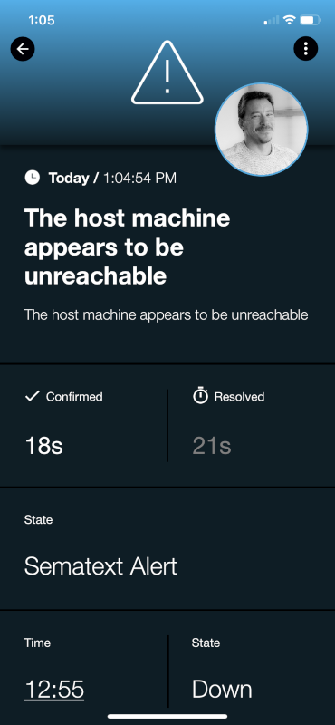
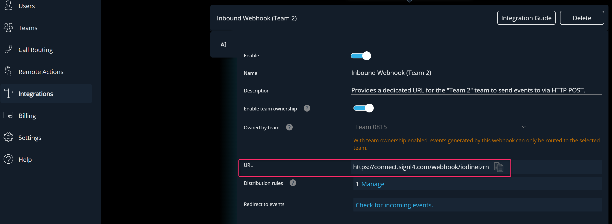
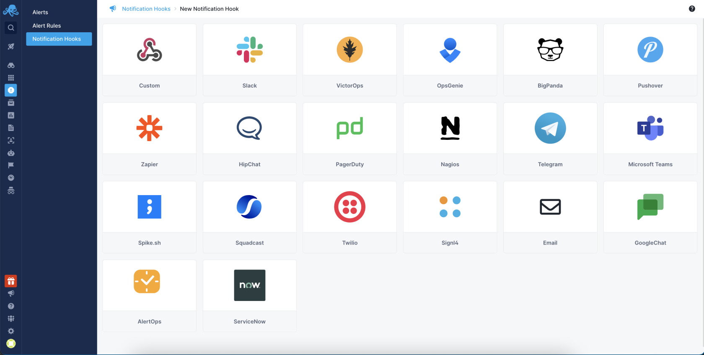
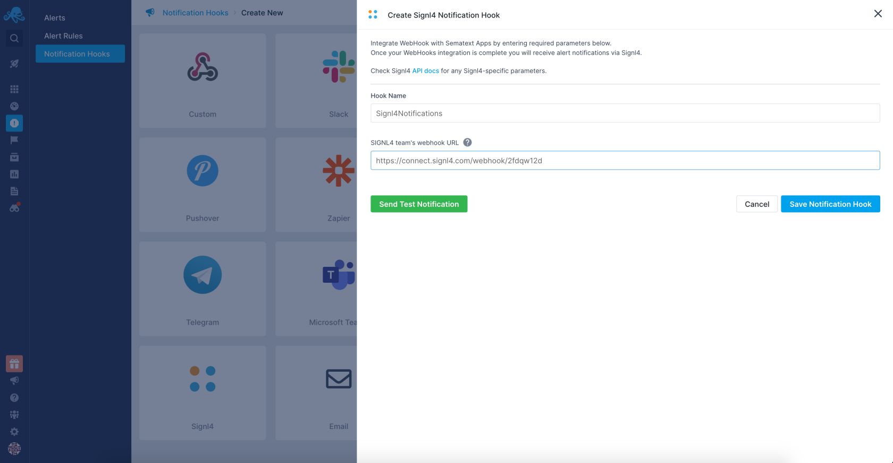

    ---
title: Sematext
parent: Integrations
---

# SIGNL4 Integration with Sematext

[Sematext](https://sematext.com/) is a hybrid monitoring service capable of detecting and troubleshoot production & performance issues with logs, metrics, and real user monitoring. Performance monitors are easy to configure, and notifications channels are configured with just a few clicks.  SIGNL4 ensures that all on duty members receive, acknowledge and resolve critical alerts, all from their smartphones. With persistent notifications and escalation chains there will never be a critical alert that goes unattended. SIGNL4 also offers ad-hoc collaboration between team members for each alert, so Subject Matter Experts can be looped in to help resolve issues.

In our example we are using Sematext to monitor the heartbeat of critical servers. We are setting up a webhook to send alerts to the SIGNL4 team when the server is unreachable.

SIGNL4 is a mobile alert notification app for powerful alerting, alert management and mobile assignment of work items.  Get the app at [https://www.signl4.com](https://www.signl4.com/)

## Prerequisites

- A SIGNL4 ([https://www.signl4.com](https://www.signl4.com/)) account
- A Sematext ([https://sematext.com/](https://sematext.com/)) account

## How to Integrate

In [SIGNL4](https://sematext.com/docs/integration/alerts-signl4-integration/) go to the Apps in the left menu and chose the Inbound Webhook to get the webhook URL.

Copy the SIGNL4 team’s webhook URL.

Navigate to [Notification Hooks](https://apps.sematext.com/ui/webhook-create) in Sematext and select Signl4 card to create a new SIGNL4 notification hook.

Add your notification hook name and SIGNL4 Inbound Webhook URL.

Next, click the Send Test Notification button. SIGNL4 should return status code 201 and the eventId indicating everything is configured correctly. Check your SIGNL4 account to see if the notification was created.

Once the notification is visible, click the Save Notification Hook button to save your configuration.

You can find more information on the [Sematext site](https://sematext.com/docs/integration/alerts-signl4-integration/) as well.

