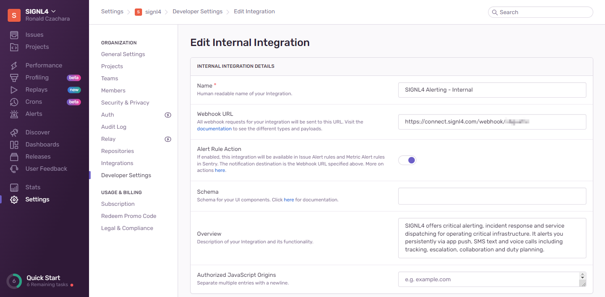
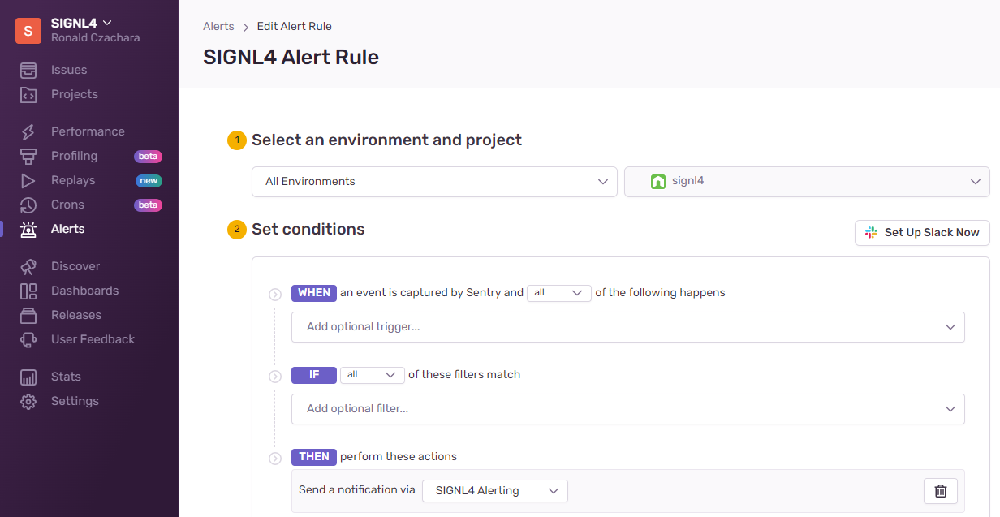
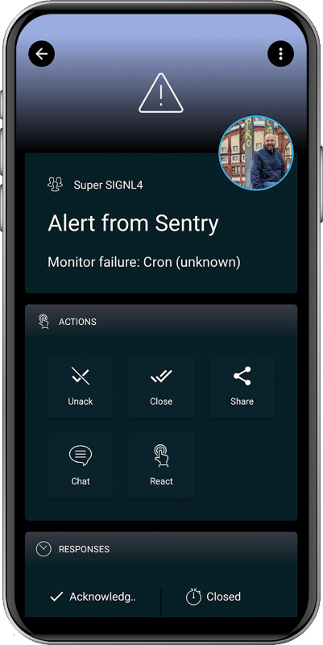

# SIGNL4 Integration with Sentry

[Sentry](https://sentry.io/) is a crash reporting platform with developers in mind. It provides real-time insight into production deployments with information to reproduce and fix crashes.

Mobile workers are not able to sit in front of a Sentry dashboard and actively monitor problems. SIGNL4 enables Sentry to notify the mobile teams in the field or on call in real-time. This speeds up their response significantly and frees resources in the operations.

In order to integrate SIGNL4 with Sentry you need to create a webhook-based integration and an alert rule.

## Integration

In the Sentry  Web portal go to Settings -> Integrations and create a new internal integration. In the settings you need to specify your SIGNL4 webhook URL including team secret and activate the check box “Alert Rule Action”. No special permissions are required. There are some additional settings, for example you can set a logo and icon, but these are optional.

## Alert Rule

Now you create a new alert rule under Alerts. You specify the conditions when to send an alert to your SIGNL4 team and in the “Then” part you select the action to send a notification via an integration and you choose the SIGNL4 integration you have created in the previous step.

That’s is and now you can test the alerting procedure. If Sentry detects an issue meeting your alerting conditions your SIGNL4 team will receive the alert.

The alert in SIGNL4 might look like this.

