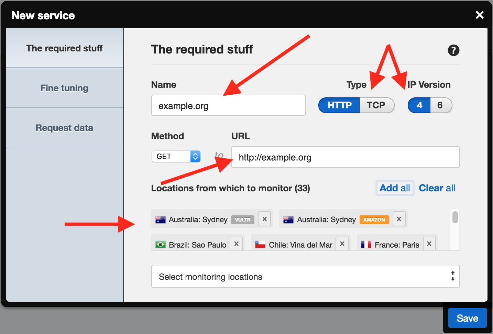
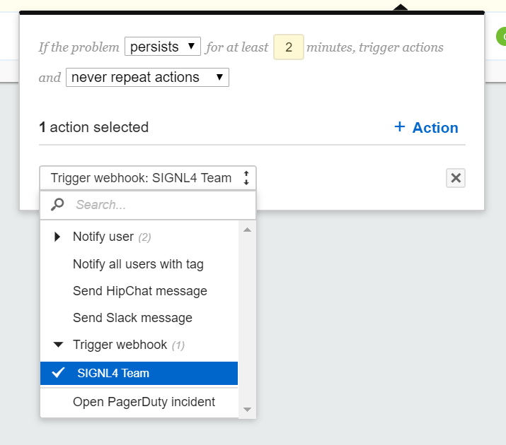
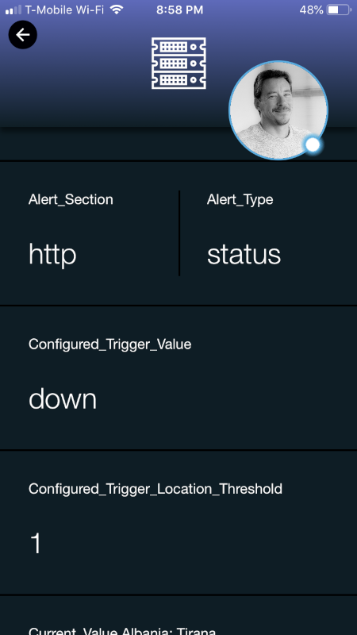
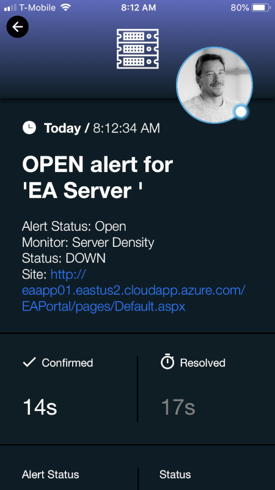

# SIGNL4 Integration with Server Density

[Server Density](https://www.serverdensity.com/) is a hybrid Server performance monitor with easy to configure dashboards and user setup.  SIGNL4 ensures that all on duty members receive, acknowledge and resolve critical alerts, all from their smartphones. With persistent notifications and escalation chains there will never be a critical alert that goes unattended. SIGNL4 also offers ad-hoc collaboration between team members for each and every alert, so Subject Matter Experts can be looped in to help resolve issues.

In our example we are using Server Density to monitor the up-time of critical servers.  We are setting up a SIGNL4 Webhook as the method of receiving the alerts.

SIGNL4 is a mobile alert notification app for powerful alerting, alert management and mobile assignment of work items.  Get the app at [https://www.signl4.com](https://www.signl4.com/)

## Prerequisites

- A SIGNL4 ([https://www.signl4.com](https://www.signl4.com/)) account
- A Server Density ([https://www.serverdensity.com/](https://www.serverdensity.com/)) account

## How to Integrate

First let’s choose a site to monitor. Click the Services icon on the left then click the + Service button in the top right.

Give the check a name, choose whether you want it to be checked over HTTP or TCP, select the IP version to use (we support both IPv4 and IPv6), add the URL and then finally select the locations you want to monitor from.

Click the Save button and after a few minutes the check will start executing.

Now, let’ setup a webhook. Click your name in the top left then go to Preferences.

Click the Notifications tab then select Webhook from the drop-down box. Give the web hook a name and enter a URL.

You can now select the web hook when choosing the recipients for an alert.

The next time that the site is unreachable alerts will be sent to your SIGNL4 team.  Sometimes these alerts will not come through as clean as they should.  This is where the Services & Systems section can augment alert titles, colors and icons.

