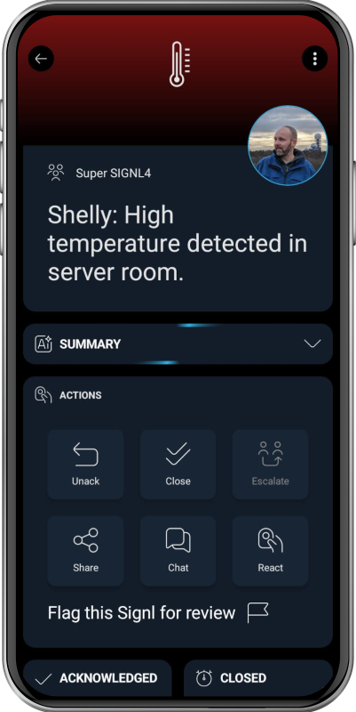

# SIGNL4 Integration with Shelly

[Shelly](https://www.shelly.com/) offers smart automation and IoT devices for monitoring and controlling lights, power, sensors, equipment, and other connected systems. Its Wi-Fi-enabled products are used in smart homes, commercial environments, and industrial IoT scenarios, providing flexible options for local and cloud-based automation.

SIGNL4 extends Shelly with reliable mobile alerting, including a mobile app, push notifications, SMS messages, voice calls, automated escalations, and on-call scheduling. SIGNL4 ensures that critical alerts reach the right people reliably – anytime, anywhere.

Some common use cases include:
- Temperature or humidity exceeds a defined threshold
- Water leakage detected in technical areas
- Door, window, or cabinet unexpectedly opened
- Abnormal power consumption or equipment failure detected
- Machine, pump, or motor requires attention

## Prerequisites
- A SIGNL4 (https://www.signl4.com/) account
- Compliant Shelly devices (https://www.shelly.com/)

## How to Integrate

Integrating SIGNL4 with Shelly devices is straightforward.

Depending on your device generation there are two options.

On Shelly Plus, Pro and newer Gen2 / Gen3 devices, you can send an HTTPS POST directly from the device, so no Node-RED, Home Assistant, or other middleware is required. Shelly OS provides both HTTP.POST and the more flexible HTTP.Request.

## Direct HTTP POST (Shelly Plus, Pro and newer Gen2 / Gen3 devices)

For SIGNL4, you can POST JSON directly to your SIGNL4 webhook URL:

```https://connect.signl4.com/webhook/YOUR_TEAM_SECRET```

Replace YOUR_TEAM_SECRET with your SIGNL4 team or integration secret.

[SIGNL4's inbound webhook](https://docs.signl4.com/integrations/webhook/webhook.html) accepts arbitrary JSON fields, with optional X-S4-* fields for things such as correlation, alert resolution, service categories, and alerting scenarios.

For example, a Shelly Script could look like this:

```JavaScript
function sendSignl4Alert() {
  Shelly.call("HTTP.Request", {
    method: "POST",
    url: "<https://connect.signl4.com/webhook/YOUR_TEAM_SECRET>",
    headers: {
      "Content-Type": "application/json"
    },
    body: JSON.stringify({
      "Title": "Shelly Alert",
      "Message": "Door opened",
      "Device": Shelly.getDeviceInfo().id,
      "X-S4-ExternalID": Shelly.getDeviceInfo().id + "-door",
      "X-S4-Status": "new"
    })
  });
}
```

You can then trigger it from a Shelly event, for example an input:

```JavaScript
Shelly.addEventHandler(function(event) {
  if (
    event.component === "input:0" &&
    event.info.state === true
  ) {
    sendSignl4Alert();
  }
});
```

This is almost exactly the HTTP notification pattern shown in Shelly's  [scripting documentation](https://shelly-api-docs.shelly.cloud/gen2/Scripts/Overview/).

An especially nice use case would be automatic resolution. When the condition returns to normal, send:

```JavaScript
{
  "X-S4-ExternalID": "same-id-as-before",
  "X-S4-Status": "resolved"
}
```

SIGNL4 will then close the previously created alert automatically.

So you could easily implement scenarios such as door opened, water leak detected, temperature too high, power consumption above threshold, machine contact triggered, or button pressed -> alert maintenance team.

## Using an intermediate service (Shelly Gen1)

With Shelly Gen1, it is more limited: Gen1 devices support Action URLs, but these are essentially URL / GET calls. They do not support Shelly Script or a configurable HTTP POST with JSON body and headers like Gen2+.

That means a Gen1 Shelly cannot directly call the standard SIGNL4 inbound webhook, because SIGNL4 expects an HTTP POST.

The simplest architecture is therefore:

```
Shelly Gen1
   │
   │ HTTP GET / Action URL
   ▼
Small intermediary
   │
   │ HTTP POST + JSON
   ▼
SIGNL4
```

For example, configure the Shelly action as something like:

```<https://your-endpoint.example/shelly?device=boiler&status=alarm```

The intermediary then sends:

```
POST https://connect.signl4.com/webhook/YOUR_TEAM_SECRET
Content-Type: application/json
{
  "Title": "Shelly Alert",
  "Message": "Boiler alarm",
  "Device": "boiler"
}
```

Replace YOUR_TEAM_SECRET with your SIGNL4 team or integration secret.

Good lightweight intermediaries would be [Node-RED](https://docs.signl4.com/integrations/node-red/node-red.html), [Home Assistant](https://docs.signl4.com/integrations/home-assistant/home-assistant.html), [n8n](https://docs.signl4.com/integrations/n8n/n8n.html), [Make](https://docs.signl4.com/integrations/make/make.html), [Pipedream](https://docs.signl4.com/integrations/pipedream/pipedream.html), a tiny web service, or something serverless such as a Cloudflare Worker. Gen1 devices can configure up to five Action URLs for events such as btn_on_url, out_on_url, temp_over_url, etc., depending on the specific Shelly model.

That's it.

The alert in SIGNL4 might look like this.


