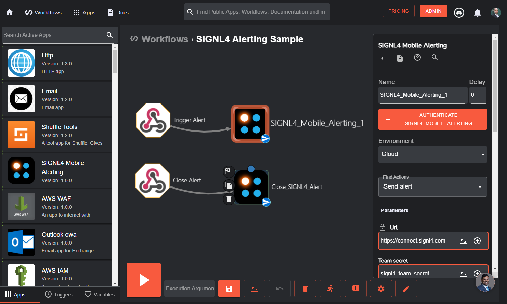
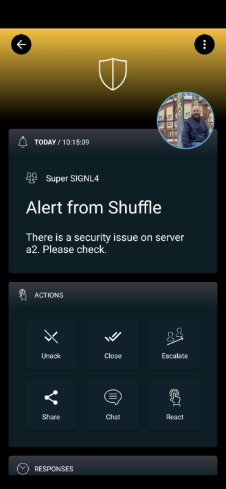

# SIGNL4 Integration with Shuffle

[Shuffle](https://shuffler.io/) is an automation platform for and by the community, focusing on accessibility for anyone to automate. Security operations is complex, but it doesn’t have to be. You can use Shuffle on premise or in the cloud.

SIGNL4 extends Shuffle and adds app-based mobile alerting and incident response including push, SMS text, voice calls, escalations and collaboration. The integrated duty planning helps you to schedule your team’s on-call duties and allows you to see who is on duty at any given time.

Log in to the Shuffle web portal to configure SIGNL4 alerting.

Logon to the Shuffle portal and go to Workflows. You can create or use your own workflow as you like. There is also a sample workflow that uses the SIGNL4 app. Just search for SIGNL4 in the public workflows.

In your workflow you can add the SIGNL4 App and configure it accordingly. There are two Actions available here, one for sending alerts (Send Alert) and one for closing alerts (Close Alert). When closing alerts you need to use the same External ID as for the alert you have sent before.

As Team Secret you specify your SIGNL4 team secret.

That’s it and now your SIGNL4 team will receive alerts whenever Shuffle detects a critical event.

The alert in SIGNL4 might look like this.

