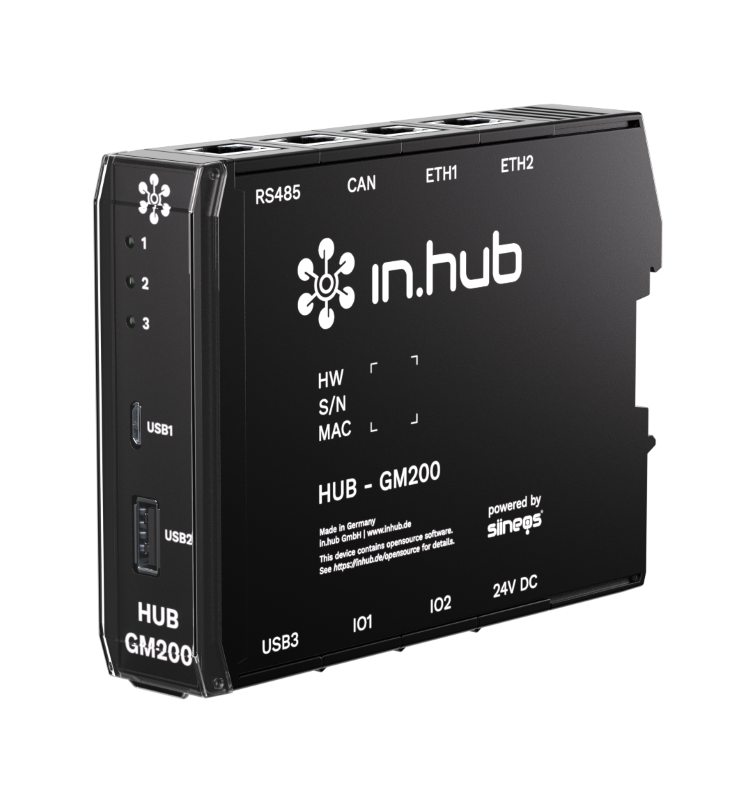
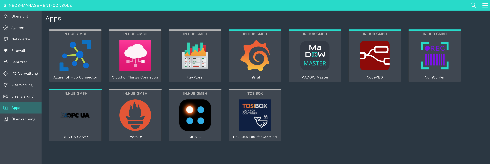
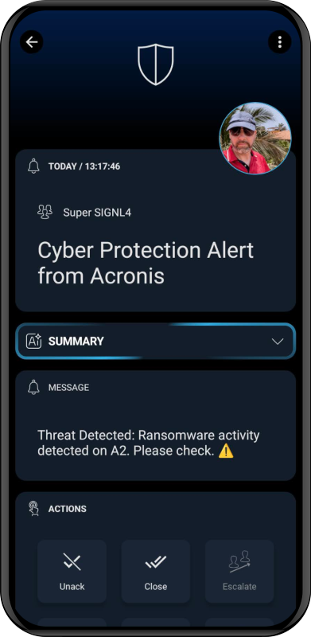

# SIGNL4 Integration with SIINEOS

[SIINEOS](https://www.inhub.de/en/products/software-siineos) by [in.hub](https://www.inhub.de/en) is a lightweight, Linux-based Industrial IoT (IIoT) operating system designed for edge devices. It enables secure remote monitoring, management, and automation of industrial processes, integrating seamlessly with cloud platforms and IIoT applications.

SIGNL4 is a mobile alerting and incident management service for alerting responsible users or teams about critical situations as quickly and as reliably as possible. It supports app push, SMS test, voice calls, including escalation, shift planning and collaboration. Get the started at [https://www.signl4.com](https://www.signl4.com/).

Gathering events from sensors and IoT devices and sending team alerts in case of critical incidents is a rather vast field. Devices from in.hub can help bridge the OT / IT gap. It is a "fitness tracker for devices and processes". You can connect production facilities, PLCs, sensors, IoT devices, or dry contacts.

When a critical state, like a high temperature, has been detected SIGNL4 takes care about finding and alerting the right people so they can take care immediately.

## Prerequisites
- A [SIGNL4](https://www.signl4.com/) account
- A device with [SIINEOS](https://www.inhub.de/en/products/software-siineos) installed
SIGNL4 is natively available in in SIINEOS (v2.9.0 and higher) under Apps.

## How to Integrate

The integration is straightforward. In SIINEOS you just need to go to Apps -> SIGNL4 and configure your team or integration secret here.

Make sure SIINEOS has access to the internet to transmit HTTP requests to SIGNL4 for triggering the alerts.

## SIGNL4 Alerting

The alert in SIGNL4 might look like this.

