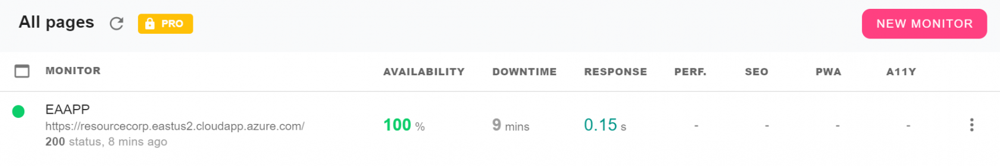
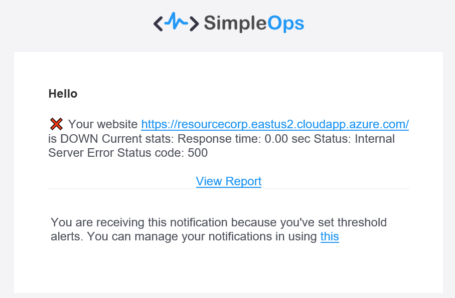
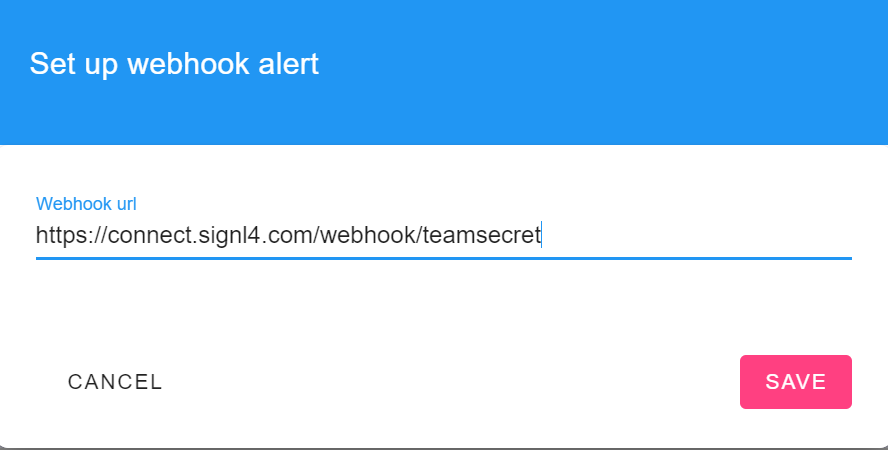
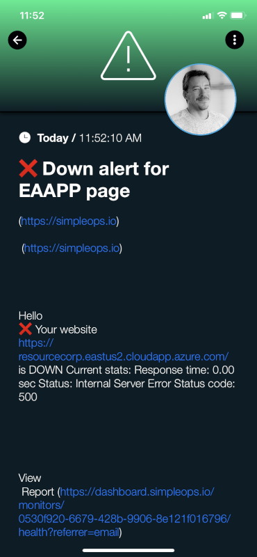

# SIGNL4 Integration with SimpleOps

[SimpleOps](https://simpleops.io/) is a cloud based site monitoring solution that is very lightweight and easy to get started.  Performance monitors are easy to configure, and notifications are automatically sent to the email address who signed up for the account.  Additional channels such as push, slack and messenger are also available.   SIGNL4 ensures that all on duty members receive, acknowledge and resolve critical alerts, all from their smartphones. With persistent notifications and escalation chains there will never be a critical alert that goes unattended. SIGNL4 also offers ad-hoc collaboration between team members for each alert, so Subject Matter Experts can be looped in to help resolve issues.

In our example we are using SimpleOps to monitor the heartbeat of critical servers.  We are setting up a site monitor and will send alerts to the SIGNL4 team when the server is unreachable.

SIGNL4 is a mobile alert notification app for powerful alerting, alert management and mobile assignment of work items.  Get the app at [https://www.signl4.com](https://www.signl4.com/)

## Prerequisites

- A SIGNL4 ([https://www.signl4.com](https://www.signl4.com/)) account
- A SimpleOps ([https://simpleops.io/](https://simpleops.io/)) account

## How to integrte

First, lets add a monitor. On the Pages menu option, click on the New Monitor button.

Enter a URL to monitor and click Save.

Next, we need to add the alert notifications. By default, the email address signed up will receive these alerts.

We are going to add the SIGNL4 Webhook so ensure that on-duty team members get notified on their cell via push, sms and voice call. From the Alerts menu option select Channels and then Webhook Notifications.

Enter the team specific webhook URL and click Save.

The next time the site goes down, all SIGNL4 team members will receive notifications via the mobile app, SMS and Voice calls.

