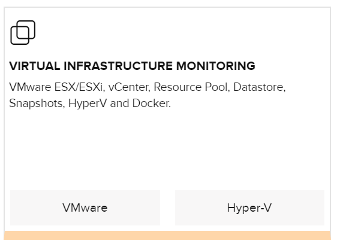
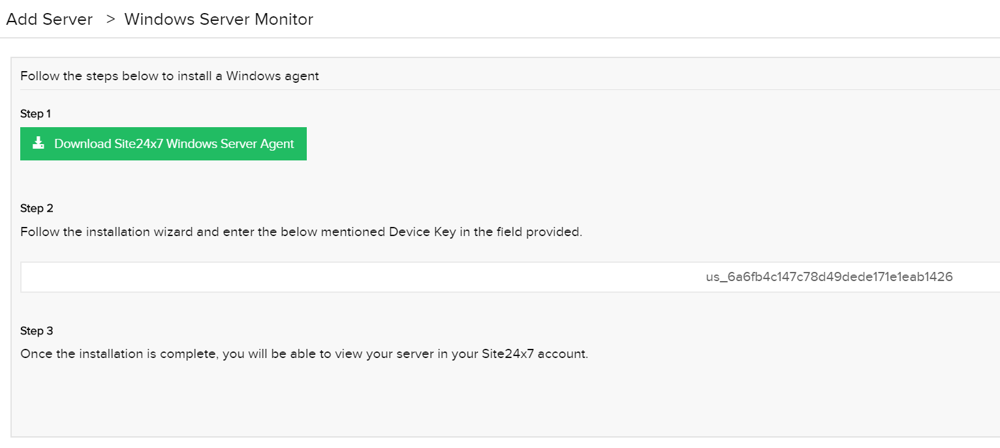
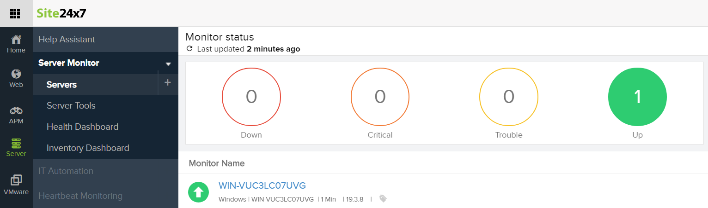
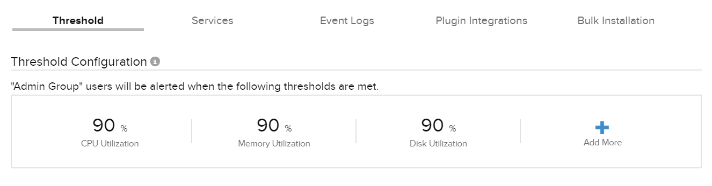
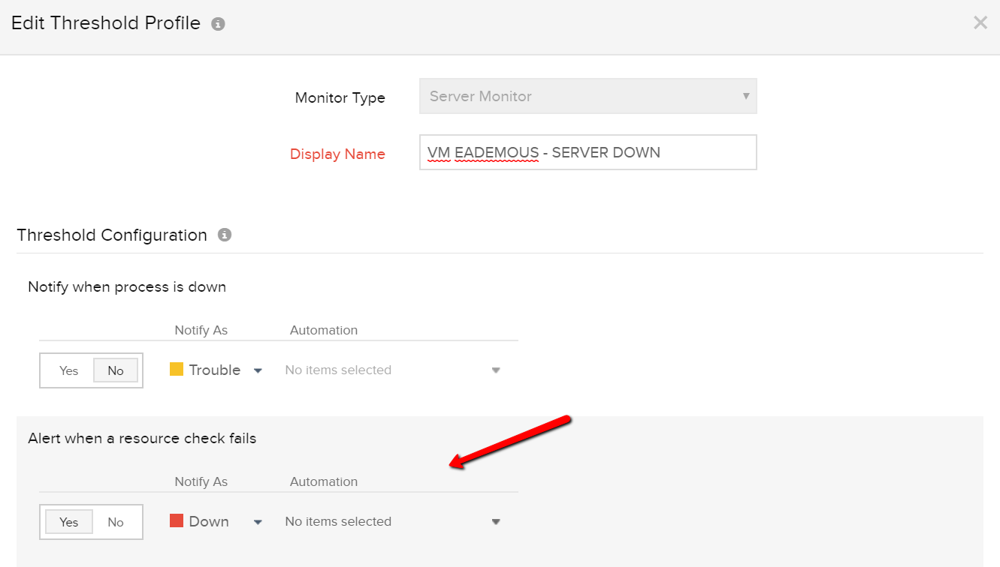
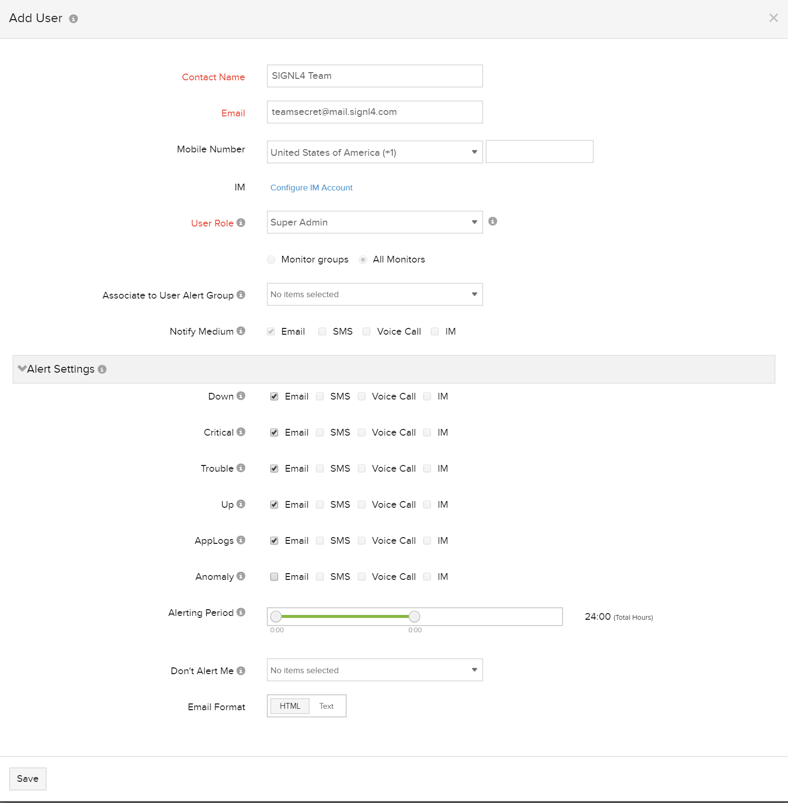
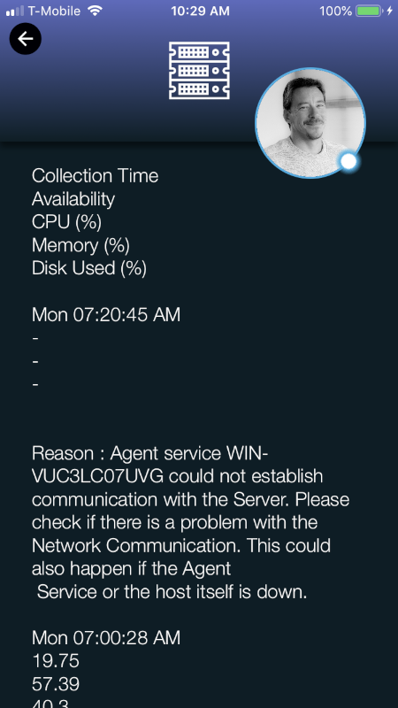
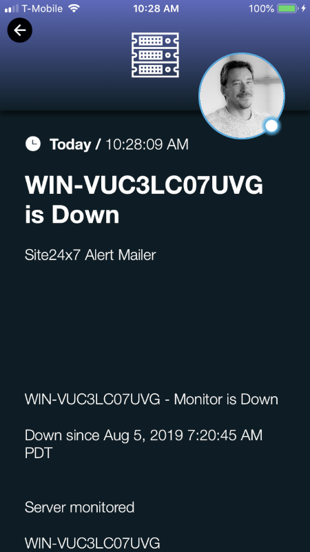

# SIGNL4 Integration with Site24x7

[Site 24×7](https://www.site24x7.com/) is a hybrid Server and performance monitor with easy to configure dashboards and user setup.  SIGNL4 ensures that all on duty members receive, acknowledge and resolve critical alerts, all from their smartphones. With persistent notifications and escalation chains there will never be a critical alert that goes unattended. SIGNL4 also offers ad-hoc collaboration between team members for each and every alert, so Subject Matter Experts can be looped in to help resolve issues.

In our example we are using Site 24×7 to monitor the up-time of critical servers. We are setting up an end user with the SIGNL4 email address to send alerts when a Hyper-V VM can not be reached.

SIGNL4 is a mobile alert notification app for powerful alerting, alert management and mobile assignment of work items.  Get the app at [https://www.signl4.com](https://www.signl4.com/).

## Prerequisites

- A SIGNL4 ([https://www.signl4.com](https://www.signl4.com/)) account
- A Site 24×7 [https://www.site24x7.com](https://www.site24x7.com/)) account

## How to integrate

For this integration we will use the downloadable agent and install it to a Hyper-V VM. From the Home screen select the Hyper-V button under Virtual Infrastructure Monitoring.

Select the Windows logo.

Download the agent and follow the instructions on the Site24x7 website.

Within a few minutes you will see the server show up on the site under Sever monitor > Servers.

By default, the following monitors are setup. Click the + sign to add more.

We added a resource check as shown below.

Next we need to connect SIGNL4 to Site24x7 by creating a user with the SIGNL4 team email address. Under the Admin section under Users & Alerts click Add User and enter in the details for this user.

Upon creating the contact you will immediately get an alert within SIGNL4 to confirm and join the organization. Follow the link in the alert and create the login.

All on-duty team members will start receiving the alerts generated from Site 24×7 as they happen in real-time.

