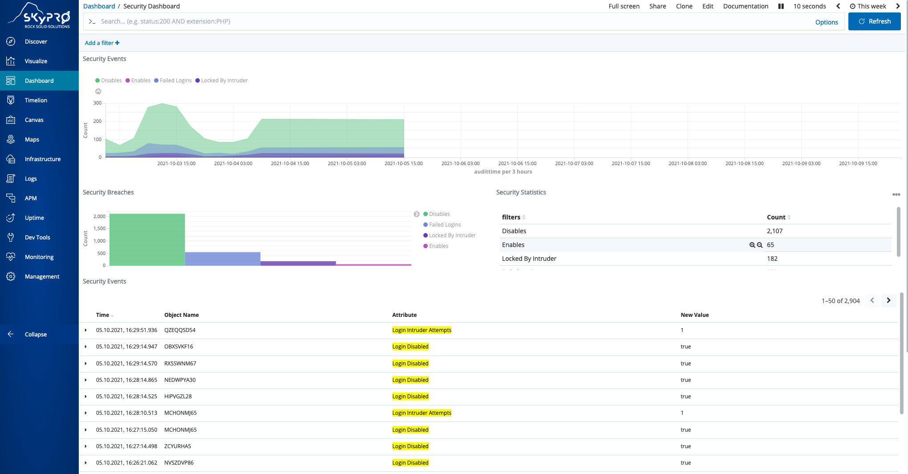
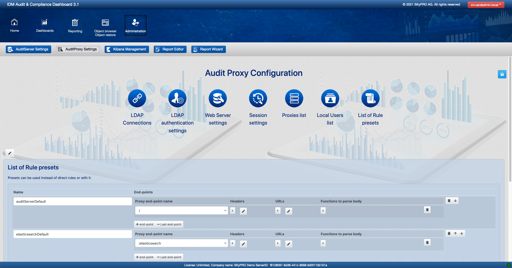
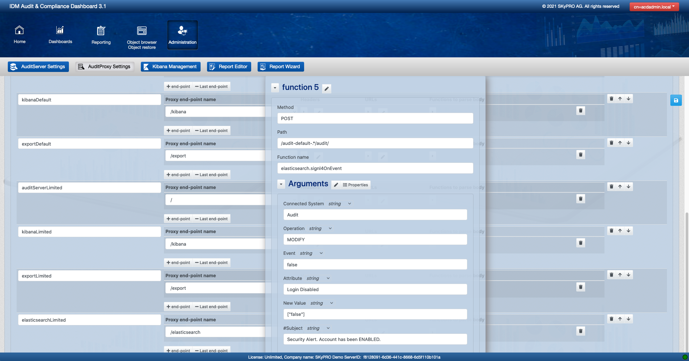

# SIGNL4 Integration with SKyPRO

[SKyPRO](https://www.skypro.eu/) is a specialist in access and identity governance. They have a focus on Directory Management, no matter if eDir, AD or AAD. With the help of SKyPRO’s Audit & Compliance Dashboard (ACD), security problems can be detected in time and, by means of automated processes, appropriate actions can be executed that reliably and consistently enforce your security policies.

The integration of SKyPRO’s ACD with SIGNL4 enables the fast and reliable alerting of IT staff and IT on-call teams before small problems become big disasters.

SIGNL4 is a mobile alert notification app for powerful alerting, alert management and mobile assignment of work items. Get the app at [https://www.signl4.com](https://www.signl4.com/).

In our example we have configured SKyPRO’s ACD to detect the following possible security threat: a previously disabled user account gets activated again. If an employee leaves the company the respective user account gets deactivated. If this account gets re-activated again this might be a security threat. The responsible employees need to get an alert immediately.

## SKyPRO's Audit & Compliance Dashboard

The ACD shows an overview of current and past events and security breaches.

## ACD Configufation

Under Administration you can configure the ACD and manage the rules.

You can configure SIGNL4 alerting as a function in the ACD. The function name is “elasticsearch.signl4OnEvent”. You can then specify the conditions and as Subject you can enter a description that is send as part of the SIGNL4 alert.

The alert in SIGNL4 might look like this.

