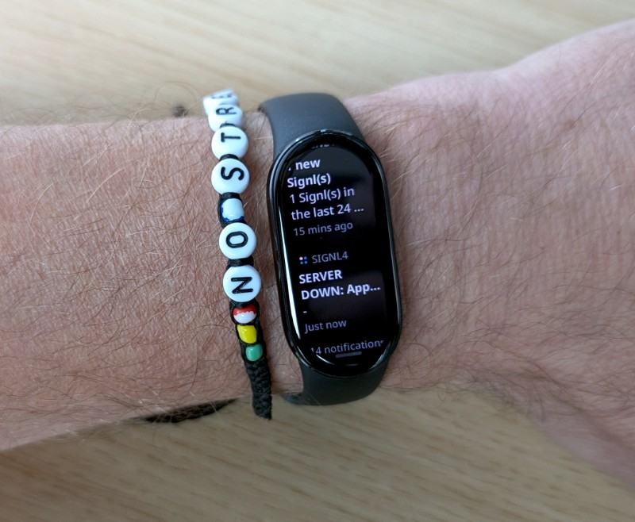
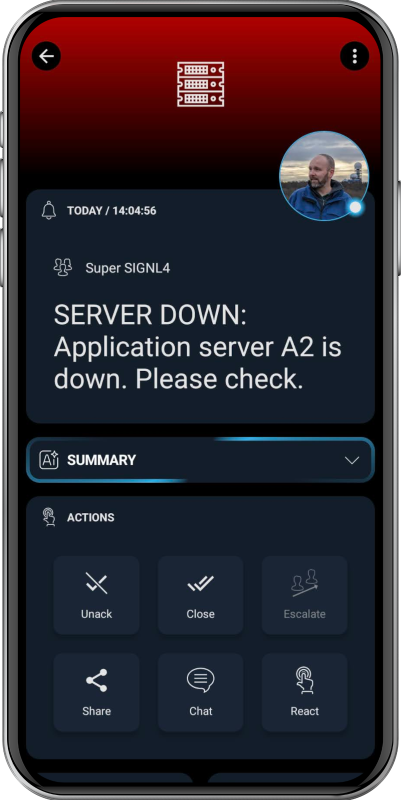

# SIGNL4 Integration with Smartwatches and Fitness Bands

Smartwatches and fitness bands have become incredibly popular, not just for tracking activity, but also for displaying smartphone notifications. These devices can vibrate to alert you of incoming messages, emails, or app alerts – making them a handy companion for staying informed. With a bit of configuration, you can even forward **SIGNL4 alerts** directly to your wearable device.

For instance, you can set up SIGNL4 to first send a **soft push notification**. If you don’t acknowledge the alert within a certain timeframe, the system will escalate by triggering a **loud phone call**. This method is especially useful at night: the initial push notification causes your fitness band to gently vibrate, waking you softly without disturbing others. But if you happen to miss it, the follow-up phone call ensures the message gets through – albeit with enough volume to wake the whole household.

SIGNL4 integrates seamlessly with a wide range of systems in **IT operations, production, IoT, and field service management**, delivering **reliable mobile alerting** for critical incidents. Its powerful feature set includes a mobile app, push notifications, SMS, voice calls, automated escalation workflows, and duty scheduling. Together, these capabilities ensure that important alerts reach the right people – **instantly and reliably**, no matter the time or location.

When paired with a smartwatch or fitness band, SIGNL4 becomes even more effective. This combination enhances the alerting experience, making life easier for on-call engineers by providing both subtle and escalated notifications, tailored to the urgency of the situation.

## Prerequisites

A SIGNL4 ([https://www.signl4.com](https://www.signl4.com)) account
A smartwatch or fitnessband supporting notifications

## How to Integrate

How to Enable SIGNL4 Notifications on Your Smartwatch or Fitness Band
To receive SIGNL4 alerts on your smartwatch or fitness band, follow these steps:

1. Set Up Notification Forwarding in Your Wearable App
Depending on the brand of your smartwatch or fitness tracker, open its corresponding mobile app on your smartphone (where the SIGNL4 app is also installed).
Within the wearable app, enable notification forwarding for the SIGNL4 mobile app. Make sure vibration alerts are enabled so you’ll feel the notifications on your wrist.

2. Configure Notifications in the SIGNL4 App
Open the SIGNL4 app on your smartphone and go to:
Settings -> Signaling
Here, you can customize how you receive alerts—e.g., enable instant push notifications or add a delayed phone call. Adjust the settings to suit your preferences and urgency levels.

3. Receive Alerts on Your Wearable
Once everything is set up, any alert received by the SIGNL4 app will trigger a notification – and a vibration – on your smartwatch or fitness band, ensuring you're always informed, even when your phone is out of reach.

The alert in SIGNL4 might look like this.

