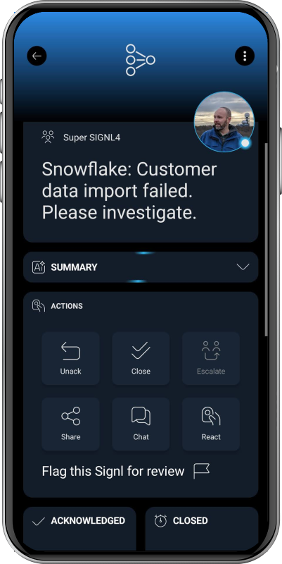

# SIGNL4 Integration with Snowflake

[Snowflake](https://www.snowflake.com/) is a cloud-based data and AI platform for storing, processing, analyzing, and sharing data. Organizations use Snowflake for data warehousing, analytics, data engineering, applications, and AI workloads across large volumes of business and operational data.

SIGNL4 extends Snowflake with reliable mobile alerting, including a mobile app, push notifications, SMS messages, voice calls, automated escalations, and on-call scheduling. This helps ensure that critical data, pipeline, operational, or business events detected in Snowflake reach the right people reliably – anytime, anywhere.

Some common use cases include:
- mobile alerting for failed or delayed data pipelines
- notification when data quality checks detect an issue
- escalation of critical business or operational thresholds
- on-call notification for data engineering and operations teams
- mobile alerting for unusual queries, workloads, or resource usage

## Prerequisites
- A SIGNL4 (https://www.signl4.com/) account
- A Snowflake (https://www.snowflake.com/) account with permissions to create the required objects

## How to Integrate

Integrating SIGNL4 with Snowflake is straightforward. A Snowflake stored procedure can send an HTTP POST request directly to the SIGNL4 webhook using a Snowflake External Access Integration.

### 1. Get Your SIGNL4 Webhook

In SIGNL4, create or select a webhook integration and copy your webhook URL. It looks like this:

```text
https://connect.signl4.com/webhook/YOUR_SIGNL4_SECRET
```

`YOUR_SIGNL4_SECRET` is your SIGNL4 team or integration secret.

### 2. Create a Snowflake Network Rule and Secret

Create a network rule that allows outbound HTTPS access to SIGNL4. Store your SIGNL4 team of integration secret in a Snowflake secret instead of adding it directly to the procedure code.

```sql
CREATE OR REPLACE NETWORK RULE signl4_network_rule
  MODE = EGRESS
  TYPE = HOST_PORT
  VALUE_LIST = ('connect.signl4.com');

CREATE OR REPLACE SECRET signl4_team_secret
  TYPE = GENERIC_STRING
  SECRET_STRING = 'YOUR_SIGNL4_SECRET';
```

### 3. Create the External Access Integration

Create an External Access Integration that allows the stored procedure to connect to SIGNL4 and use the secret.

```sql
CREATE OR REPLACE EXTERNAL ACCESS INTEGRATION signl4_access
  ALLOWED_NETWORK_RULES = (signl4_network_rule)
  ALLOWED_AUTHENTICATION_SECRETS = (signl4_team_secret)
  ENABLED = TRUE;
```

Depending on your Snowflake roles and permissions, an administrator might need to create the integration or grant the required privileges.

### 4. Create the SIGNL4 Stored Procedure

Create a reusable Python stored procedure that sends an event to SIGNL4.

```sql
CREATE OR REPLACE PROCEDURE send_signl4_alert(title STRING, message STRING)
RETURNS STRING
LANGUAGE PYTHON
RUNTIME_VERSION = '3.12'
PACKAGES = ('snowflake-snowpark-python', 'requests')
HANDLER = 'send_alert'
EXTERNAL_ACCESS_INTEGRATIONS = (signl4_access)
SECRETS = ('team_secret' = signl4_team_secret)
AS
$$
import requests
import _snowflake


def send_alert(session, title, message):
    team_secret = _snowflake.get_generic_secret_string('team_secret')
    url = "https://connect.signl4.com/webhook/" + team_secret

    payload = {
        "Title": title,
        "Message": message,
        "Source": "Snowflake",
        "X-S4-SourceSystem": "Snowflake"
    }

    response = requests.post(url, json=payload, timeout=10)
    response.raise_for_status()

    return "SIGNL4 alert sent"
$$;
```

### 5. Test the Integration

Call the procedure manually to send a test alert to SIGNL4.

```sql
CALL send_signl4_alert(
  'Snowflake Test Alert',
  'Hello from Snowflake. The SIGNL4 integration is working.'
);
```

The alert should arrive in SIGNL4 within a few seconds.

### 6. Trigger SIGNL4 from a Snowflake Alert

You can now call the procedure from a Snowflake Alert whenever a SQL condition becomes true. The following example checks for rows marked with an error flag every five minutes.

```sql
CREATE OR REPLACE ALERT data_quality_alert
  WAREHOUSE = my_warehouse
  SCHEDULE = '5 MINUTE'
  IF (EXISTS (
      SELECT 1
      FROM my_database.my_schema.my_table
      WHERE error_flag = TRUE
  ))
  THEN
      CALL send_signl4_alert(
          'Snowflake Data Quality Alert',
          'Invalid data was detected. Please check the affected data.'
      );

ALTER ALERT data_quality_alert RESUME;
```

You can adapt the SQL condition and alert text to your own use case, for example failed data loads, missing data, unusual resource consumption, delayed processing, or business-critical thresholds.

That's it.

Your Snowflake events can now trigger actionable mobile alerts in SIGNL4 and automatically reach the person who is currently on call via push, SMS, or voice call, including acknowledgement and escalation.

The alert in SIGNL4 can look like this:


